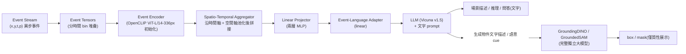
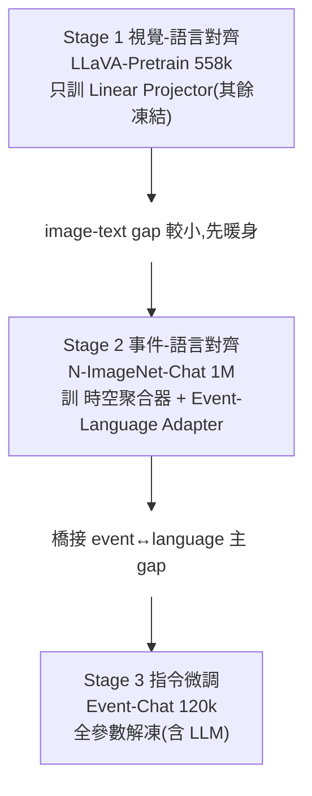

# 一句話總結 (TL;DR)
> **第一個能「看懂事件相機(event camera)資料」的多模態大模型** — 把 event stream 接進 LLM(Vicuna),經三階段訓練橋接 event↔language 的巨大 domain gap,能對事件流做場景描述、推理、問答。**意義不在模型本身(7B/13B 重,邊緣跑不動),而在它打通了「event 模態 ↔ 語言」這條路**。event 模態天生適合邊緣裝置:稀疏、微秒延遲、高動態範圍、低功耗。

---

# 背景:event camera 是什麼?

傳統相機**整幀同步曝光**(30/60 fps);事件相機(DVS)**每個像素獨立、異步**地只在「亮度變化超過閾值」時吐出一個事件 $(x, y, t, p)$(座標、微秒時間戳、極性±)。

| 特性 | 傳統 RGB | **Event camera** |
|---|---|---|
| 時間解析度 | 毫秒級(幀率) | **微秒級** |
| 動態範圍 | ~60 dB | **>120 dB**(逆光/隧道口不過曝) |
| 運動模糊 | 高速會糊 | **無**(異步) |
| 資料量 | 稠密整幀 | **稀疏**(只傳變化) |
| 功耗 | 高 | **低**(neuromorphic) |
| 弱點 | 低光/高速/HDR 差 | **靜止場景幾乎無輸出**、無顏色紋理 |

> **關鍵視角**:event 的強項(低光、高速、HDR、低功耗)正好補 RGB 的弱項 —— 跟 IR 一樣是「退化場景的救援模態」,但 event 額外贏在**時間解析度 + 邊緣功耗**。

---

# 三大貢獻

1. **EventGPT** — 第一個 event stream understanding 的 MLLM(場景摘要 / 推理 / 問答),為跨模態研究立下 baseline。
2. **系統化三階段訓練範式** — 以預訓練 LLM 為錨,用專門網路模組漸進橋接 event↔language 的巨大 domain gap。
3. **兩個大規模 event-text 資料集** — **N-ImageNet-Chat**(1M 合成預訓練)+ **Event-Chat**(120k 真實世界 instruction),將公開。

---

# 方法核心

## 整體架構



數學上:事件特徵 $V = f_{enc}(S)$ → 時空聚合 $E = f_{ST}(V)$ → 投影對齊 $E = f_{proj}(f_{align}(E))$ → $A = f_{llm}(E \mid Q)$。

## ① 時空表示(event 的特殊處理)
event 流先切成時間 bin、堆成 event tensors,過 encoder 得 $\mathcal Z \in \mathbb R^{T \times S \times D}$,再**沿時間軸 $T$ 與空間軸 $S$ 各自池化、拼接**成融合表示 $\bar{\mathcal Z}$ —— 用一個端到端學到的時空特徵濃縮異步事件。

## ② 模組:橋接 domain gap 的四件套
| 模組 | 作用 |
|---|---|
| **Event Encoder** | OpenCLIP ViT-L 初始化(借 CLIP 的強特徵),抽 event 特徵 |
| **Spatio-Temporal Aggregator** | 聚合時空動態(event 的核心,RGB MLLM 沒有) |
| **Linear Projector(2-MLP)** | 把視覺特徵投到 LLM 輸入空間 |
| **Event-Language Adapter(linear)** | 專門對齊 event ↔ language |

## ③ 三階段訓練(漸進對齊,關鍵設計)

- **資料**:N-ImageNet-Chat(基於 N-ImageNet 用 event simulator 從 ImageNet 合成 + GPT 生文,1M 預訓練)、Event-Chat(DSEC/E2VID 真實自駕,含低光/高速/隧道,120k 指令:caption/VQA/推理)。
- 訓練於 **8× RTX 6000 Ada**;LLM = Vicuna-v1.5 7B/13B。

## ④ Downstream(偵測/分割)的真實機制:文字驅動(關鍵,易誤解)

> ⚠️ 論文 §5.4 的 downstream **不是**「時空特徵直接接輕量頭出 box」,而是**文字驅動**:
> - **偵測**:EventGPT 生成「物件的文字描述」→ 餵 Grounding DINO (ECCV 2024) 去 localize。
> - **分割**:EventGPT 提供「語意 cue」→ 引導 GroundedSAM 生 mask。
> - Fig 8/9 標題明寫「**text generated by EventGPT**」,且為**質性展示**(無定量、無延遲 / FPS)。
>
> 即 **EventGPT(LLM)+ GroundingDINO + SAM 三個大模型串接,重 pipeline、非即時**。
> 👉「**砍掉 LLM、把時空特徵直接接輕量判別頭做即時出 box**」是 §8 的**創新方向(論文未做、未驗證)**,不是論文貢獻。

---

# 實驗結果

評測自建 benchmark(因為 event-MLLM 無現成基準),三指標各 1–5 分:**DC**(細節描述)、**CR**(複雜推理)、**VQA**。

| 模型 | LLM | Event-Chat DC | CR | VQA |
|---|---|---:|---:|---:|
| LLaVA-7B | Vicuna-7B | 2.20 | 4.04 | 3.26 |
| Qwen2-VL-7B | Qwen2 | 2.38 | 4.02 | 2.91 |
| DeepSeek-VL-7B | DeepSeek | 2.41 | 4.10 | 3.37 |
| **EventGPT-7B** | Vicuna-7B | **3.52** | **4.09** | **4.29** |
| **EventGPT-13B** | Vicuna-13B | 3.40 | **4.13** | 4.26 |

> 把 event 當成普通影像餵給通用 MLLM(LLaVA/Qwen2-VL)表現差;EventGPT 專門對齊後**細節描述(DC)與 VQA 顯著領先**。Fig.6 的隧道口案例:極端逆光下 EventGPT 仍正確答出「隧道出口有車」,通用 MLLM 答錯 —— **印證 event 在 HDR 場景的價值**。

---

# 我的快速理解模型 (Mental Model)

把 EventGPT 想成「**教一個只看過照片的人,改看示波器**」:
- **LLM(Vicuna)** = 一個很會講話、看慣 RGB 照片的人。
- **Event stream** = 示波器式的「只顯示變化」的畫面(沒看過,完全陌生)。
- **三階段訓練** = 先用「看照片講話」暖身(Stage1)→ 再大量看「示波器↔文字」配對學翻譯(Stage2)→ 最後實戰問答微調(Stage3)。
- **時空聚合器** = 幫他把「一串閃動的點」整理成「一個看得懂的時空圖」。
- 結果:他能看著示波器流暢描述「有台車正高速穿過隧道」。

---

# 引用
```
@inproceedings{liu2025eventgpt,
  title={EventGPT: Event Stream Understanding with Multimodal Large Language Models},
  author={Liu, Shaoyu and Li, Jianing and Zhao, Guanghui and Zhang, Yunjian and Meng, Xin and Yu, Fei Richard and Ji, Xiangyang and Li, Ming},
  booktitle={CVPR},
  year={2025}
}
```
