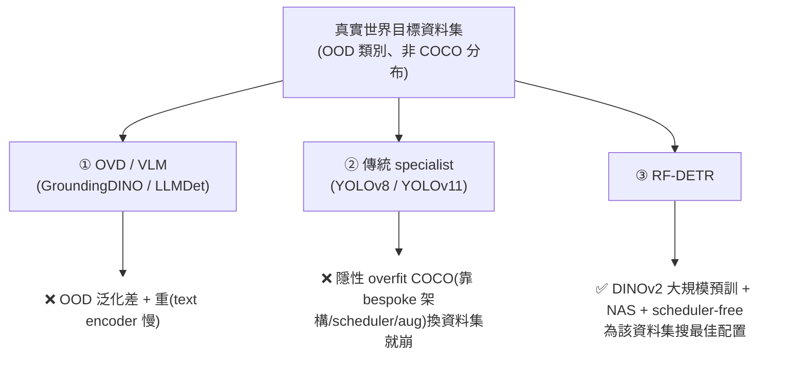
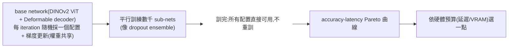

# 一句話總結 (TL;DR)
> **「別追通用,為你的資料集訂做」** —— 論文同時打兩個對象:**OVD/VLM**(真實世界 OOD 泛化差 + 重)與**傳統 specialist**(YOLOv8/v11,隱性 overfit COCO、換資料集就崩)。RF-DETR 的解法:以 **DINOv2 內部大規模預訓練** + **weight-sharing NAS**,為任一目標資料集**一次訓練、搜出數千種配置的 accuracy-latency Pareto 曲線(不重訓)**。**RF-DETR-2XL 60.1 AP —— 第一個 COCO 破 60 的實時模型**;還做**分割**(RF-DETR-Seg,第一個 end-to-end NAS 偵測+分割)。⚠️ 它**不是 OVD、是 specialist** —— 對 OVD 路線而言,是一個必須認真對待的對立觀點。

---

# 2. ★ 核心論點:雙重批判(全篇靈魂)

論文開宗問「**Are Specialist Detectors Over-Optimized for COCO?**」,同時否定兩條主流路:



- **對 OVD**:VLM 對「預訓練沒見過的類別/模態」泛化差,fine-tune 又重(text encoder)。
- **對傳統 specialist**:YOLOv8/v11 靠精調的 scheduler/augmentation 在 COCO 刷分 → **隱性 overfit**;在 RF100-VL(100 個真實領域資料集)上**輸給 DETR 系,且放大也不改善**。
- **RF-DETR 的立場**:做「**更好的 specialist**」—— 用 internet-scale 預訓(DINOv2)給先驗、用 NAS 為每個資料集/硬體找最佳輕量配置、**scheduler-free**(不假設固定 optimization horizon)。

> ⚠️ **設計啟示**:RF-DETR 把「開放詞彙 vs 固定類別」變成每個部署案都得先回答的問題——若類別固定,specialist + NAS 可能更準更省;若詞彙常變、需要 zero-shot 新類,才值得付 OVD 的成本。

---

# 3. 方法核心

## 架構(Fig 2):DINOv2 ViT(multi-scale)+ Deformable decoder + det/seg 頭
- **backbone**:**DINOv2 預訓練 ViT**,抽**多尺度**特徵(不是單尺度);**交錯 windowed / non-windowed attention** 平衡精度-延遲。取代 LW-DETR 的 CAEv2 → **+2% AP**(DINOv2 預訓練知識)。
- **decoder**:Deformable cross-attention + self-attention + FFN,多層(Decoder Group);deformable cross-attn 與 seg head 都 bilinear 上採 projector 輸出。
- **雙頭**:Detection Head(class + box)、**Segmentation Head**(輕量,depthwise conv;RF-DETR-Seg 在 Objects-365 + SAM2 pseudo-mask 預訓)。
- **關鍵**:**所有 decoder 層都算 loss** → 推論可 **drop 任意 decoder 層**(甚至砍到 0 層變 single-stage) → NAS 的基礎。
- **消費級 GPU 友好**:projector 用 layer norm 取代 batch norm + 梯度累積。

## weight-sharing NAS(核心創新,靈感 OFA)

**五個 tunable knobs(Fig 3)**——推論時調這些選 Pareto 上的點:

| # | 維度 | 快 ← → 準 |
|---|---|---|
| a | **Patch size**(FlexiViT 插值) | 大 patch 少 token(快)← → 小 patch 多 token(準) |
| b | **Decoder 層數** | 少層(快,可砍到 single-stage)← → 多層(準) |
| c | **Query token 數** | 少 query(快)← → 多 query(準);drop 依 class logit sigmoid 排序 |
| d | **影像解析度** | 低(快)← → 高(小物件好) |
| e | **每 block window 數** | 影響全域資訊混合與效率 |

> **精髓**:一個 base network 訓練後,**上面所有點都由同一次訓練導出**(Fig 1 caption 明說);「architecture augmentation」還當 **regularizer 提升泛化**。**這是它對「部署」最實用的貢獻** —— 一次訓練、多硬體零重訓。

---

# 4. 實驗結果

## COCO 偵測(Table 2,T4 TensorRT10 FP16)
| Model | Params | GFLOPs | Latency | AP | AP_S | AP_L |
|---|---:|---:|---:|---:|---:|---:|
| RT-DETR (R18) | 36.0M | 100.0 | 4.4ms | 49.0 | 32.8 | 65.0 |
| D-FINE (N) | 3.8M | 7.3 | 1.9ms | 42.7 | 22.9 | 62.1 |
| **RF-DETR (N)** | 30.5M | 31.9 | **2.5ms** | **48.0**(+5.3 vs D-FINE-N) | 25.2 | 70.0 |
| **RF-DETR (S)** | 32.1M | 59.8 | 3.5ms | 52.9 | 32.0 | 73.0 |
| **RF-DETR (2XL)** | 126.9M | 438.4 | 17.2ms | **60.1** | 43.2 | 76.2 |

> **RF-DETR-2XL 60.1 AP = 第一個實時破 60 的偵測器**;各 size vs D-FINE/LW-DETR/RT-DETR/YOLOv8/v11 **#1 或 #2**。RF-DETR-S(52.9@3.5ms)比 RT-DETR-R18(49.0@4.4ms)又準又快。

## COCO 分割(Table 3)—— RF-DETR-Seg
- **RF-DETR-Seg 存在且是貢獻**:第一個 end-to-end weight-sharing NAS for 分割。
- RF-DETR-Seg-N 40.3 AP^m,**勝 FastInst +5.4%、快近 10×**;RF-DETR-Seg-L 勝 MaskDINO(R50)於 fraction of runtime。

## RF100-VL(Table 4,100 真實領域資料集)—— 泛化才是重點
- **RF-DETR-2XL 勝 GroundingDINO(tiny) 與 LLMDet (CVPR 2025)(tiny)**,只用 fraction of runtime。
- **YOLOv8/v11 在此輸給 DETR 系,且放大模型不改善** → 坐實「YOLO overfit COCO」。
- RT-DETR 在此勝 D-FINE(AP50)→ D-FINE 的超參 overfit COCO。

## NAS 消融(Table 5)
LW-DETR(M) 52.6 → +DINOv2 backbone **+2%** → +O365 預訓 → +weight-sharing NAS → **54.6**;**NAS 讓精度 +2% over LW-DETR 而不增延遲**。

---

# 5. 我的快速理解模型 (Mental Model)

「**訂做西裝 + 一次打版試穿數千種**」:
- **OVD** = 號稱人人能穿的均碼(你的體型/資料集一穿就不合,還很重)。
- **傳統 specialist(YOLO)** = 照「COCO 這個人」量身做的西裝,換人(換資料集)就不合。
- **RF-DETR** = 拿一件**大廠半成品(DINOv2 預訓)**、按你的體型改(fine-tune 目標資料集),再用 **NAS 一次打版試穿數千種版型(不用每件重做)**,依你的預算(延遲/VRAM)挑一件最合身又輕的。代價:只合你穿(specialist,不通用開放詞彙)。

---

# 引用
```
@inproceedings{robinson2026rfdetr,
  title={RF-DETR: Neural Architecture Search for Real-Time Detection Transformers},
  author={Robinson, Isaac and Robicheaux, Peter and Popov, Matvei and Ramanan, Deva and Peri, Neehar},
  booktitle={ICLR},
  year={2026}
}
```
