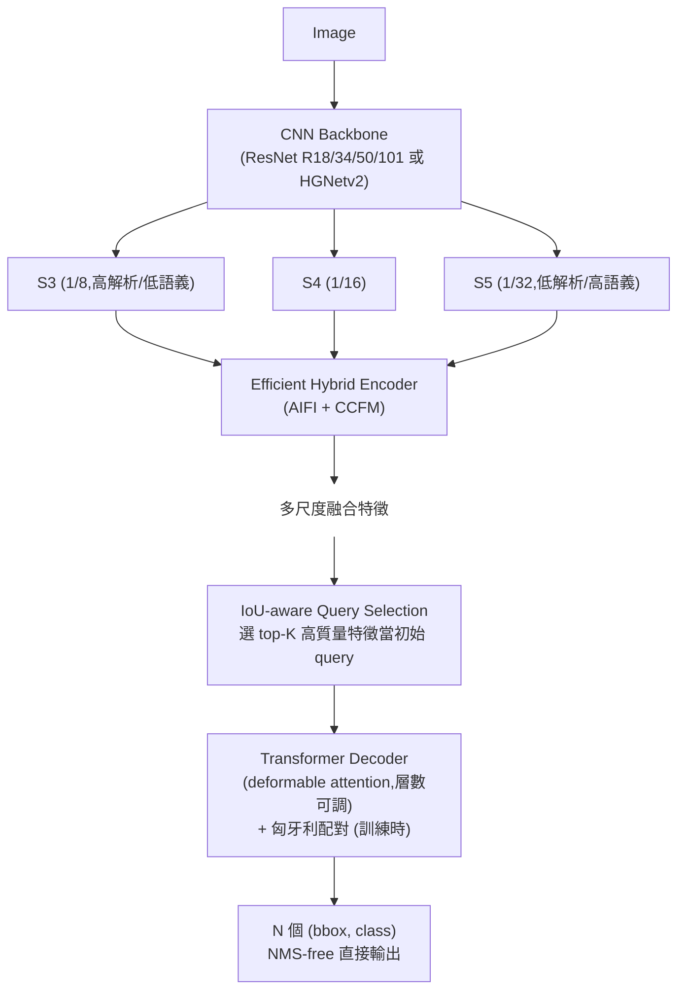
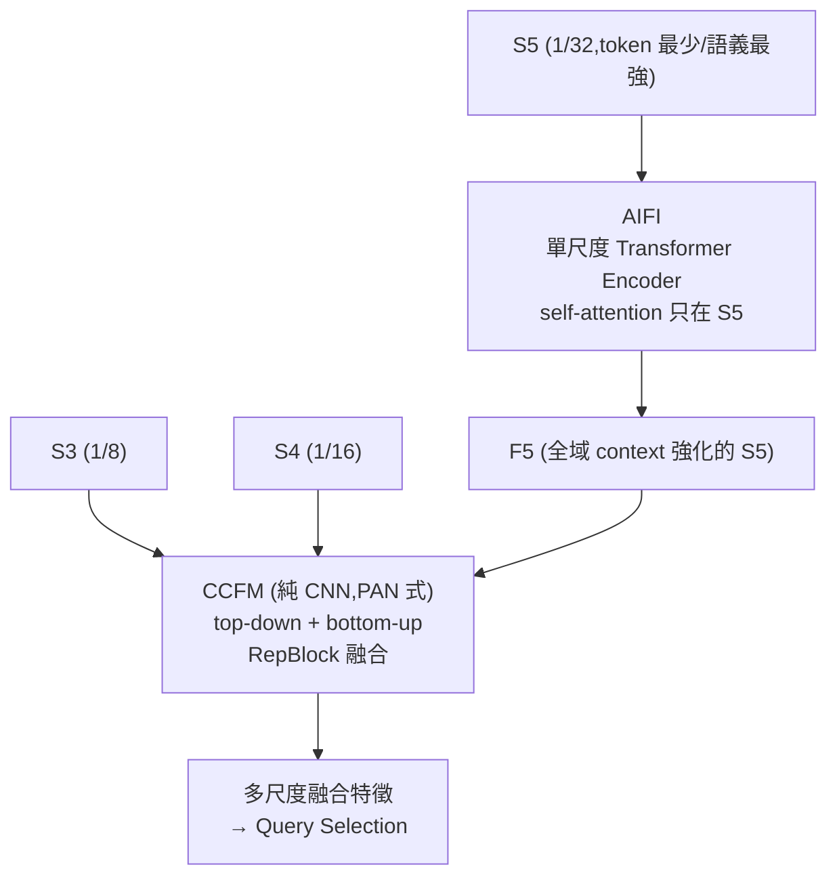

# 一句話總結 (TL;DR)
> **第一個在速度與精度上「同時」打贏 YOLO 的端到端偵測器** — 把 DETR (ECCV 2020) 系從「準但慢」變成「準又即時」。三招:**Efficient Hybrid Encoder**(只對最高層做 attention、跨尺度交給 CNN,解掉 DETR encoder 的計算瓶頸)、**IoU-aware Query Selection**(給 decoder 又準又自信的起點)、**可調 decoder 層數**(同一權重做速度-精度權衡,免重訓)。整體 **NMS-free**,把「即時偵測必須是 YOLO + NMS」這個信念一次打掉。

---

# 為什麼必讀

| 面向 | YOLO 系(v5/v8) | RT-DETR |
|---|---|---|
| 去重複框 | **NMS 後處理**(超參數敏感、延遲隨框數波動) | **NMS-free**,承襲 DETR set prediction |
| 速度-精度權衡 | 換模型大小 / 調 conf 閾值 | **調 decoder 層數即可**,不用重訓 |
| encoder 為何 DETR 慢? | (沒這問題) | **多尺度 self-attention 是瓶頸** → 本篇解掉 |
| 部署延遲 | NMS 使端到端延遲不確定 | **延遲穩定**,對 TensorRT 友好 |

> **意義**:DETR 系長期被嫌「不能即時」、YOLO 長期被嫌「要 NMS、非端到端」。RT-DETR **一次解掉兩邊痛點**,是 DETR 系實時化的里程碑,也是「即時 OVD 該選 YOLO 系還是 DETR 系」這個工程抉擇的關鍵對照組。

---

# 背景:DETR 為什麼「準但不能即時」?

要懂 RT-DETR 的價值,先懂它在救什麼。DETR (ECCV 2020) → Deformable DETR → DINO (ICLR 2023) 這條線一路把 DETR 變**準**(COCO SOTA),但都**沒解決速度**。慢在哪?

1. **Encoder 是計算黑洞**。DINO 系的 encoder 對 backbone 出來的**所有尺度**特徵(S3/S4/S5)做 deformable attention。token 數 = $\sum_i H_iW_i$,其中**最高解析度的 S3 token 最多**(640 輸入時 S3 = 80×80 = 6400,而 S5 只有 20×20 = 400)。self-attention 是 $O(N^2)$,token 一多就爆。**encoder 才是 DETR 不即時的主因,不是 decoder。**
2. **YOLO 的「即時」其實有隱形稅**:它快,但要 **NMS** 後處理 — 而 NMS 不可微、有超參數、延遲還隨場景中框數浮動(見下面 NMS 分析)。

RT-DETR 的目標因此很明確:**保留 DETR 的 NMS-free(端到端)優勢,同時把 encoder 的速度做到 YOLO 等級**。

---

# 三大貢獻(概覽)

1. **Efficient Hybrid Encoder** — 把多尺度特徵交互**解耦**成 AIFI(只在最高層 S5 做 self-attention)+ CCFM(跨尺度用 CNN 融合),大幅降低 encoder 計算量,是即時的關鍵。
2. **IoU-aware Query Selection** — 選初始 query 時用 IoU 約束分類分數,讓「分類高分」的 query 同時「定位也準」,給 decoder 更好的起點。
3. **可調速度 + NMS-free** — 同一套權重靠**調整 decoder 層數**即可做速度-精度權衡(無需重訓);端到端輸出,免 NMS 超參數與不確定延遲。

---

# 方法核心

## 整體架構



---

## ① Efficient Hybrid Encoder — RT-DETR 的靈魂

這是全篇最重要的設計,也是「為什麼能即時」的答案。

### 問題:多尺度 self-attention 為何是瓶頸
DINO 式 encoder 把 S3+S4+S5 攤平成一長串 token 一起做 attention。S3 token 數最多 → 主導計算量。但**低層特徵(S3)解析度高、語義卻最弱**(只有邊緣紋理),花最貴的 attention 在它身上,CP 值極低。

### AIFI(Attention-based Intra-scale Feature Interaction)
> **核心洞察:只對最高層 S5 做 self-attention。**

- **為什麼只 S5?** 高層特徵已含**完整的物件語義**(「這是一隻貓」這種概念級資訊),token 又最少(400 vs 6400)。對它做 intra-scale self-attention,能用最小成本提煉「概念之間的關係」(全域 context)。
- **為什麼不對低層做?** 論文明說:對低層做 intra-scale attention **不僅貴,還可能有害** — 低層缺語義,特徵間的關聯弱,硬做 attention 反而引入冗餘與混淆。
- 形式上 AIFI = 一個**單尺度** Transformer encoder(就是標準 self-attention + FFN),只吃 S5。

### CCFM(CNN-based Cross-scale Feature Fusion)
> 跨尺度的融合(把 S3/S4 與強化後的 S5 接起來)改用**純 CNN**,不用昂貴的 attention。

- 結構是 **PAN 式**(path aggregation:top-down + bottom-up)的 fusion block,內部由若干 **RepBlock**(可重參數化卷積)組成。
- 跨尺度資訊融合本來就是 CNN 的強項(FPN/PAN 多年驗證),不需要動用 attention。

### Hybrid Encoder 內部流程


> **一句話**:**貴的 attention 只花在最值得的 S5(intra-scale);便宜的 CNN 處理跨尺度融合(cross-scale)。** 這個「分而治之」就是 encoder 提速的全部秘密。

### 消融:encoder 一步步演化(論文 Table 3,趨勢)
| 變體 | encoder 設計 | 速度 | AP |
|---|---|:--:|:--:|
| A | DINO 式多尺度 deformable encoder(baseline) | 慢(基準) | 基準 |
| B | 改成只在 S5 的單尺度 attention | **快很多** | ≈持平 |
| C | B 再加 CNN 跨尺度融合 | 快 | ↑ |
| **D = AIFI + CCFM(本文)** | intra(attn,只S5)+ cross(CNN) 解耦 | **最快** | **最高** |

> 重點不是某個精確 AP 數字(以原文為準),而是趨勢:**把 attention 從「全尺度」縮到「只 S5」,速度大增而 AP 不降反升** — 證明了低層 attention 確實是浪費。

---

## ② IoU-aware Query Selection

### 背景:query selection 是什麼
DETR-like 模型的 decoder 需要一組**初始 object query**。現代做法(如 DINO (ICLR 2023) 的 mixed selection)是從 **encoder 輸出特徵裡選 top-K** 當初始 query — 等於先讓 encoder 提名「最可能是物件的位置」。

### 問題:挑選依據「分類分數」與「定位質量」不一致
傳統只用**分類分數**選 top-K。但一個特徵「分類分數高」不代表它「框得準(IoU 高)」。結果常選到**嘴上自信、實際框歪**的 query,decoder 起點就差。

### 解法:訓練時讓分類分數去對齊 IoU
RT-DETR 在分類分支的訓練目標裡**注入 IoU 約束** — 讓正樣本的分類目標**趨向其與 GT 的 IoU**(思路同 VarifocalNet 的「IoU-aware 分類分數」)。直觀寫:

$$\text{分類目標} \;\propto\; \text{IoU}(\hat b, b_{gt})$$

於是「分類分數高」⟺「定位也準」。再用這個對齊後的分數選 top-K,挑出的 query **又自信又框得準**。

### 消融(論文,趨勢)
| query selection | 高分類分數 query 的定位質量(IoU) | AP |
|---|:--:|:--:|
| vanilla(只看分類分數) | 分散、常低 | 基準 |
| **IoU-aware(本文)** | **明顯集中在高 IoU** | **↑** |

> 論文用「分類分數 vs IoU」散點圖佐證:IoU-aware 之後,高分類分數的點同時也高 IoU(兩者正相關),vanilla 則散開。

---

## ③ Decoder + 速度彈性

- decoder 沿用 **deformable attention**(承襲 Deformable DETR / DINO),配匈牙利二分配對訓練(同 DETR (ECCV 2020))。
- **關鍵部署特性:層數可調、免重訓。** 因為 DETR-like 每層 decoder 都接 auxiliary head(深監督),**每一層都能獨立出框**。所以推論時可以「早退」—— 例如把 6 層砍到 3 層,速度↑、AP 只小降,**用同一份權重**即可。
- 這讓同一個 RT-DETR 能依硬體(雲端 / 邊緣裝置)彈性選速度檔位,工程上極實用。

---

## NMS-free 的價值:NMS 的隱形成本分析

論文專門分析了「YOLO 的即時是有代價的」:

1. **兩個超參數**:NMS 需要 score threshold 與 IoU threshold。兩者都影響最終 AP,得逐資料集調。
2. **延遲不確定**:NMS 要先濾掉低分框、再對剩下的兩兩比 IoU 去重。**剩餘框數越多,NMS 越慢** → 端到端延遲隨「畫面裡有多少物件 / 閾值設多少」浮動,不是常數。
3. RT-DETR **沒有 NMS** → 延遲是確定的、無超參數、對 TensorRT 等部署引擎更友好。

> 所以「RT-DETR 比 YOLO 快」不只贏在 backbone/encoder,還贏在**省掉了 NMS 這段不可控的後處理**。

---

# 實驗結果

## 主結果(COCO val2017,T4 GPU,TensorRT FP16)

| Method | Backbone | AP | FPS(T4) | 端到端 |
|---|---|---:|---:|:--:|
| YOLOv7-L | — | 51.2 | (含 NMS) | ❌ |
| YOLOv8-L | — | 52.9 | ~71(含 NMS) | ❌ |
| YOLOv8-X | — | 53.9 | (含 NMS) | ❌ |
| **RT-DETR-R50** | ResNet-50 | **53.1** | **108** | ✅ |
| **RT-DETR-R101** | ResNet-101 | **54.3** | **74** | ✅ |
| **RT-DETR-L** | HGNetv2 | **53.0** | **114** | ✅ |
| **RT-DETR-X** | HGNetv2 | **54.8** | **74** | ✅ |

> **同精度更快、同速度更準**,且全程 NMS-free。**首次有 DETR 系在 T4 上的速度-精度全面壓過同期 YOLO**。

## Scale 版本
- backbone 可選 **ResNet R18/R34/R50/R101**(學術對比)或 **HGNetv2-L/X**(部署優化)。
- 加上 decoder 層數可調 → 形成一整條速度-精度曲線,覆蓋從邊緣到雲端。

## 消融小結
- **Hybrid Encoder**:相比 baseline encoder,大幅提速且 AP 不降反升(見上表)。
- **IoU-aware query selection**:小幅但穩定的 AP 提升,且讓高分 query 的定位更可靠。
- **decoder 層數**:減層→提速、AP 緩降,提供免重訓的彈性。

---

# 我的快速理解模型 (Mental Model)

把 RT-DETR 想成「**幫 DETR 減肥 + 改體質的私人教練**」:

- **DETR 的肥肉** = encoder 對所有尺度狂做 attention(又重又慢)。
- **教練三招**:
  - **AIFI** = 「**只練核心肌群**」:只對最有料的高層 S5 做 attention,低層別浪費(練了還受傷)。
  - **CCFM** = 「**雜事外包給便宜的 CNN**」:跨尺度融合不必動用昂貴 attention。
  - **IoU-aware selection** = 「**選隊員看綜合實力**」:不只聽他嘴上自信(分類分),還看實際命中率(IoU)。
- **加碼**:decoder 像「可拆節數的伸縮梯」,要快就少架幾節,同一把梯子(權重)就能用。
- 結果:DETR 瘦身又練好體質,**跑得跟 YOLO 一樣快,還不用 NMS 這根拐杖**。

---

# 與 DETR 系的精確對照

| | Deformable DETR | DINO | **RT-DETR** |
|---|---|---|---|
| Encoder | 多尺度 deformable attention | 多尺度 deformable attention | **Hybrid:AIFI(只S5 attn)+ CCFM(CNN)** |
| Query 初始化 | learnable / two-stage | mixed query selection | **IoU-aware query selection** |
| Decoder | deformable | deformable + look forward twice + CDN | deformable(層數可調) |
| 主打 | 收斂快 + 多尺度 | **準**(COCO SOTA) | **即時**(速度-精度勝 YOLO) |
| NMS | 不需要 | 不需要 | 不需要 |

> 一句話:**Deformable DETR/DINO 是把 DETR「變準」的主線;RT-DETR 是從這條線分出、把 DETR「變快」的即時化分支**(見 DETR & Grounding 系譜)。

---

# 引用
```
@inproceedings{zhao2024rtdetr,
  title={DETRs Beat YOLOs on Real-time Object Detection},
  author={Zhao, Yian and Lv, Wenyu and Xu, Shangliang and Wei, Jinman and Wang, Guanzhong and Dang, Qingqing and Liu, Yi and Chen, Jie},
  booktitle={CVPR},
  year={2024}
}
```
