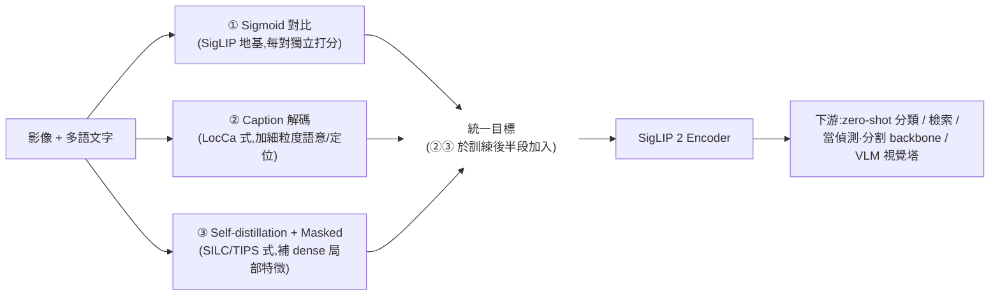

# 一句話總結 (TL;DR)
> 在 SigLIP (ICCV 2023) 的 **sigmoid loss** 地基上,用**一套統一訓練配方**把後來零散的好點子(caption 解碼預訓練、self-distillation + masked prediction、多語資料、原生長寬比 NaFlex)全部融進同一個模型。結果:同尺寸下 zero-shot 分類/檢索**全面優於 SigLIP**,而且**dense 特徵(分割/深度)、定位(referring)、多語**大幅補強——一個 backbone 通吃,是目前開放詞彙偵測(OVD)預訓練 encoder 的首選之一。

---

# 為什麼要讀 (Why)

| 面向 | SigLIP (2023) | SigLIP 2 (2025) |
|---|---|---|
| 訓練目標 | 純 sigmoid 對比 | sigmoid **+ caption 解碼 + self-distillation + masked** 統一配方 |
| dense / 局部特徵 | 弱(對比預訓練天生偏全域語意) | **明顯補強**(適合分割、偵測這類密集任務) |
| 語言 | 以英文為主 | **原生多語** + 公平性/去偏配方 |
| 解析度 / 長寬比 | 固定方形 | **NaFlex**:單一模型吃可變解析度 + 原生長寬比 |
| 對 OVD 的意義 | 可當 CLIP 的替身 | **更強的文字-視覺對齊 + 局部特徵**,對偵測更友善 |

> 一句話:SigLIP 給了「更好的對比 loss」;SigLIP 2 給了「一個什麼都強一點的通用 encoder」。

---

# 三大貢獻

1. **統一訓練配方** — 不是新 loss,而是把 sigmoid 對比、LocCa 式 caption 解碼、SILC/TIPS 式 self-distillation + masked prediction 疊進同一次訓練(後半段才加入 distillation/masked,省算力)。
2. **能力全面上移** — 同尺寸、同評測協定下,分類、檢索、dense 預測(分割/深度/法線探針)、referring 定位、多語與文化多樣性全部優於 SigLIP。
3. **NaFlex 變體** — 融合 FlexiViT(可變 patch/序列長)與 NaViT(原生長寬比)的精神,單一 checkpoint 服務多種解析度,對「不想失真縮放」的下游任務特別有用。

---

# 方法核心

## 統一配方:一鍋煮四道菜



- **① Sigmoid 對比**:承襲 SigLIP——每對 (image, text) 獨立用 sigmoid 打分,不必大 batch all-gather。
- **② Caption 解碼**:掛一個文字 decoder 做 captioning / grounded caption,逼視覺特徵帶更細的語意與位置線索(對定位任務關鍵)。
- **③ Self-distillation + Masked prediction**:借鏡 SILC / TIPS——用 EMA teacher 對 local patch 做自蒸餾 + 遮罩預測,把「全域語意好、局部特徵弱」的老毛病補起來。**這一支是 dense 任務(分割/偵測)變強的主因。**
- **多語 + 去偏**:用多語 web 資料並套公平性配方,讓非英文與文化多樣性評測同步上移。

## NaFlex:一個模型多種形狀

- 傳統 ViT 要把圖硬縮成固定方形 → 長寬比失真、細節掉。
- **NaFlex** = FlexiViT(可變 patch size / 序列長)+ NaViT(原生長寬比 packing)的結合:同一 checkpoint 可在不同解析度、不失真長寬比下推論。
- 對 OCR、文件、細長物件(行人、桿件)這類「形狀敏感」場景加分。

## 尺寸與變體

| 家族 | 代表尺寸 |
|---|---|
| 標準 | ViT-B/16、L/16、So400m、giant |
| NaFlex | B/16、L/16、So400m/16(原生長寬比 + 可變解析度) |

> So400m(shape-optimized ~400M)是「性價比」甜蜜點,常見於下游 VLM 的視覺塔。

---

# 實驗結果重點

> 精確數字以原論文為準;此處記重點趨勢。

- **zero-shot 分類 / 檢索**:同尺寸下**一致優於 SigLIP**(ImageNet zero-shot 約有數個百分點的提升,尺寸越大差距收斂)。
- **dense 預測**:語義分割、深度、表面法線的 probing 顯著優於 SigLIP——self-distillation + masked 那一支的直接功勞。
- **定位 (referring expression)**:caption 解碼帶來的細粒度對齊讓 referring 任務明顯進步。
- **多語 / 公平性**:非英文檢索與文化多樣性評測同步上移,且不犧牲英文表現。
- **NaFlex**:在需要原生長寬比 / 可變解析度的任務(文件、OCR、細長物件)上比固定方形版更穩。

---

# 我的快速理解模型 (Mental Model)

把 SigLIP 想成「**一位對齊很準的翻譯官**」——圖與字配不配,判斷精準,但只擅長講「整張圖大概是什麼」。

SigLIP 2 是同一位翻譯官去進修了三門課:
- 上了**寫圖說**的課(caption 解碼)→ 會描述細節與位置。
- 上了**自我糾錯**的課(self-distillation + masked)→ 對「圖上哪一塊是什麼」也在行(dense)。
- 上了**外語**的課(多語)→ 不再只懂英文。

外加一副**可變焦眼鏡**(NaFlex)→ 不必把世界硬塞進方框裡看。

---

# 引用
```
@article{tschannen2025siglip2,
  title={SigLIP 2: Multilingual Vision-Language Encoders with Improved Semantic Understanding, Localization, and Dense Features},
  author={Tschannen, Michael and others},
  journal={arXiv preprint arXiv:2502.14786},
  year={2025}
}
```
