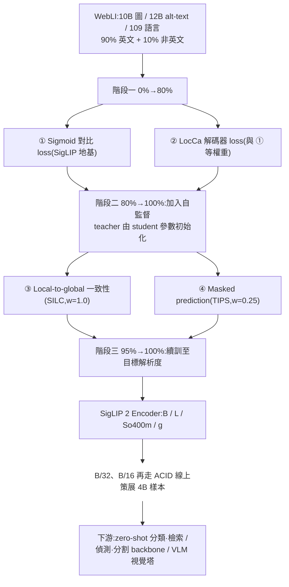

# 一句話總結 (TL;DR)
> 在 SigLIP (ICCV 2023) 的 <strong>sigmoid loss</strong> 地基上,把後來各自獨立被證明有效的四招——<strong>LocCa 式 caption/定位解碼、SILC 式 local-to-global 自蒸餾、TIPS 式 masked prediction、ACID 線上資料策展</strong>——熔進<strong>同一次 40B 樣本的訓練</strong>。結果:<strong>同尺寸同解析度全面優於 SigLIP</strong>(ImageNet zero-shot B/16 +2.0、L/16 +2.0),而 <strong>dense 預測(ADE20k +4.6 mIoU)、定位(RefCOCO +16.5)、多語(XM3600 +17.9)</strong>是跳躍式補強。架構刻意與 SigLIP <strong>向後相容</strong>——換權重與 tokenizer 就能升級。

---

# 為什麼必讀

| 面向 | SigLIP (ICCV 2023) | SigLIP 2 (2025) |
|---|---|---|
| 訓練目標 | 純 sigmoid 對比 | sigmoid <strong>+ LocCa 解碼(全程)+ 自蒸餾/masked(最後 20%)+ ACID 策展</strong> |
| dense / 局部特徵 | 弱(天生偏全域語意) | <strong>跳躍式補強</strong>(ADE20k 40.8 → 45.4) |
| 定位 | 幾乎沒訓過 | RefCOCO val 70.76 → <strong>87.28</strong> |
| 語言 / 解析度 | 英文 tokenizer、固定方形 | <strong>多語 Gemma tokenizer(256k)</strong> + <strong>NaFlex</strong>(可變序列長 + 原生長寬比) |
| 與前代關係 | — | <strong>刻意 backward compatible</strong>:同架構,換 weights + tokenizer 即可 |

> 💡 一句話:SigLIP 給了「更好的對比 loss」;SigLIP 2 給了「<strong>一個什麼都強一點、而且可以原地換上去</strong>的通用 encoder」。而且它<strong>自己量了 OVD</strong>(Table 4,丟進 OWL-ViT (ECCV 2022) 微調),這在基礎 encoder 論文裡很少見。

# 背景:SigLIP (ICCV 2023) 之後,VLM 預訓練學到了什麼

2023–2025 這段期間,幾條線各自被證明有效,但<strong>散在不同論文、各自訓各自的模型</strong>:

1. <strong>對比 loss 本身可以更好</strong> — CLIP (ICML 2021) 的 softmax/InfoNCE 需跨裝置 all-gather 算全域正規化;SigLIP 換成 <strong>pairwise sigmoid</strong>,每對獨立二元分類,batch 可拆。這步已成定局,SigLIP 2 直接繼承。
2. <strong>Caption 預訓練補得到對比學不到的東西</strong> — LocCa 發現:<strong>掛一個文字 decoder 做 captioning / 指涉表達 / grounded caption</strong>,能顯著改善 <strong>OCR 與定位</strong>。直覺:對比 loss 只要求「整張圖 ↔ 整句話」對得上,不逼模型知道「哪個東西在哪」;autoregressive 解碼會。
3. <strong>自監督能修好對比預訓練的老毛病</strong> — 對比預訓練<strong>全域語意強、局部 patch 特徵弱</strong>,做分割/深度就露餡。SILC 證明 <strong>local-to-global 自蒸餾</strong>(DINO 家族 EMA teacher 思路,見 11_自監督學習 (SSL - MAE DINO SimCLR))能拉起 dense 特徵;TIPS 證明再加 <strong>masked prediction</strong> 連 zero-shot 分類與檢索也一起漲。
4. <strong>資料策展 ≈ 免費的蒸餾</strong> — ACID/ACED 發現:與其蒸老師的 logits(貴),不如用老師<strong>線上挑批次</strong>(learnability scoring),小模型能拿到接近顯式蒸餾的好處。見 09_知識蒸餾 (Knowledge Distillation)。
5. <strong>多語與公平性不必另外訓一個</strong> — 換多語 tokenizer + 摻非英文資料 + 敏感屬性過濾,可在<strong>不犧牲英文</strong>的前提下大幅改善多語與表徵偏差。

SigLIP 2 的定位就是:<strong>這些全部是別人的點子,但沒人把它們放進同一鍋煮過,而本篇證明它們不打架。</strong>

# 三大貢獻(概覽)

1. <strong>統一訓練配方</strong> — 不是新 loss,而是證明 sigmoid + LocCa 解碼 + 自蒸餾 + masked + ACID <strong>可以共存於單一訓練流程</strong>,並給出「誰全程開、誰後期加、權重多少」這份可複製的食譜。
2. <strong>能力全面上移且向後相容</strong> — 四個尺寸(B 86M / L 303M / So400m 400M / g 1B)在分類、檢索、dense、referring、VLM 視覺塔、多語、公平性上<strong>全面</strong>優於 SigLIP,而且架構不變、可直接抽換。
3. <strong>NaFlex 變體</strong> — 合併 FlexiViT(單一模型多序列長)與 NaViT(原生長寬比 + padding mask)的精神,<strong>單一 checkpoint</strong> 服務多解析度,對文件/OCR/螢幕截圖這類形狀敏感輸入特別有利。

# 方法核心

## 整體配方:誰全程開、誰後期加


```mermaid
flowchart TB
    classDef el fill:transparent,stroke:none;
    DATA["WebLI:10B 圖 / 12B alt-text / 109 語言<br/>90% 英文 + 10% 非英文"] --> P1["階段一 0%→80%"]
    P1 --> SIG["① Sigmoid 對比 loss(SigLIP 地基)"]
    P1 --> CAP["② LocCa 解碼器 loss(與 ① 等權重)"]
    SIG --> P2["階段二 80%→100%:加入自監督<br/>teacher 由 student 參數初始化"]
    CAP --> P2
    P2 --> SS1["③ Local-to-global 一致性(SILC,w=1.0)"]
    P2 --> SS2["④ Masked prediction(TIPS,w=0.25)"]
    SS1 --> P3["階段三 95%→100%:續訓至目標解析度"]
    SS2 --> P3
    P3 --> ENC["SigLIP 2 Encoder:B / L / So400m / g"]
    ENC --> ACID["B/32、B/16 再走 ACID 線上策展 4B 樣本"]:::el
    ACID --> USE["下游:zero-shot 分類·檢索 /<br/>偵測·分割 backbone / VLM 視覺塔"]
```


*論文圖(第 2 頁):SigLIP 2 的訓練配方全圖。<strong>紫色虛線框</strong>圈起來的 Image Encoder(綠)+ Text Encoder(藍)那一塊直接標著 `SigLIP (v1)`——地基原封不動,右上橘標 <strong>Sigmoid loss</strong> 括號寫 <strong>100%</strong>。上方灰色 <strong>AR Decoder</strong> 透過 `cross-attn.` 吃 <strong>MAP head 之前</strong>的未池化 patch 表徵,對應橘標 <strong>LocCa loss</strong>,括號同樣是 <strong>100%</strong>,底下列出 captioning / dense captioning / ref. expressions 三個子目標。左邊多出一顆 <strong>EMA Image Encoder</strong> 當 teacher,以 `stop gradient` 與 `aux. head` 接上 <strong>SILC/TIPS loss</strong> 的 self-distillation 與 masked prediction,括號只寫 <strong>20%</strong>。圖上這兩個百分比就是本節的關鍵——<strong>LocCa 解碼全程開著且與 sigmoid 等權重,自蒸餾與 masked prediction 要到 80% 進度才接上、只跑最後那 20%</strong>。*

> ⚠️ 這是原筆記最容易寫錯的地方
> <strong>不是「②③ 都在後半段才加」。</strong> LocCa 解碼目標<strong>從第一步就開著、且與 sigmoid 等權重</strong>;只有自蒸餾與 masked prediction 是在 <strong>80% 進度</strong>才接上去(此時用 student 參數初始化 teacher,新增的 head、mask token 與其 optimizer state 隨機初始化)。這個設計是為了省算力:自監督那兩支最貴,而它們只需要末段就能把 dense 特徵拉起來。

<strong>訓練設定(原文)</strong>:batch size 32k、共見 <strong>40B 樣本</strong>、文字長度 64 tokens、<strong>多語 Gemma tokenizer(256k vocab)</strong>、Adam(lr 1e-3、wd 1e-4、grad clip 1.0)、cosine schedule + 20k warmup、基礎解析度 256px(patch 16 → 序列長 256)。

## ① Sigmoid 對比地基 — 承襲什麼

承襲 SigLIP (ICCV 2023) 原封不動:對每個 (image, text) 對獨立算 sigmoid 二元分類 loss,把 mini-batch 所有配對展成 |B|² 個「配 / 不配」問題,再用可學的 temperature 與 bias 校正正負極度不平衡。

<strong>替代方案為何不行</strong>:softmax/InfoNCE(見 03_Loss functions 速查)的正規化項跨整個 batch,分散式訓練必須 all-gather 全部 embedding;sigmoid 讓 loss 可分塊累加,記憶體與通訊成本都低,對小 batch 也更穩。SigLIP 2 沒動它——<strong>這層不是創新點,是地基</strong>。

## ② Caption 解碼目標 — 它補的是「哪個東西在哪」

架構:在視覺編碼器的 <strong>MAP pooling head 之前</strong>取未池化的 patch 表徵,接一個標準 transformer decoder(帶 cross-attention,層數為對應 encoder 的一半)。這個 decoder <strong>只在預訓練用,下游丟掉</strong>。三個同時訓練的子目標(LocCa):

| 子目標 | 做什麼 | 補什麼能力 |
|---|---|---|
| <strong>Image captioning</strong> | 生成 alt-text;<strong>50% 機率走平行預測</strong>(所有 caption token 從 mask token 一次預測、不加 causal mask) | 細粒度語意、OCR |
| <strong>Automatic referring expression</strong> | 用一個開放詞彙偵測器從 alt-text 抽 n-gram,讓模型<strong>預測該 n-gram 的 bounding box 座標</strong> | 文字 → 空間位置的對齊 |
| <strong>Grounded captioning</strong> | 給定 bbox 座標,<strong>預測該區域的區域性描述</strong> | 空間位置 → 文字的反向對齊 |

> 💡 為什麼這招對 OVD 特別重要
> 後兩個子目標本質上是<strong>在預訓練階段就偷偷做了 grounding</strong>:模型被逼著把「文字片語」與「影像座標」綁在一起。這正是 GLIP (CVPR 2022) / Grounding DINO (ECCV 2024) 那條線在下游花大力氣做的事,SigLIP 2 把它折進了 encoder 預訓練(RefCOCO 70.76 → 87.28 就是回報)。<strong>替代方案為何不行</strong>:純對比 loss 給不出位置監督;留到下游才微調 grounding,encoder 的 patch 表徵仍是「全域語意導向」,要修的東西太多。

## ③ Self-distillation + Masked prediction — dense 特徵變強的主因

兩支自監督 loss <strong>都在訓練進度 80% 時才加入</strong>:

- <strong>(a) Local-to-global 一致性(SILC,權重 1.0)</strong> — 視覺編碼器扮演 student;teacher 是 student 參數的 <strong>EMA</strong>。配置為 <strong>1 個 global view 給 teacher、8 個 local view 給 student</strong>,經獨立 MLP head 投影到高維後匹配(DINO 家族標準做法)。學生只看到局部裁切卻要匹配老師的整圖表徵 → 逼每個 local patch 自己就要「知道自己在整體中是什麼」。
- <strong>(b) Masked prediction(TIPS,權重 0.25)</strong> — 把 student 端 <strong>50% 的 patch embedding 換成 mask token</strong>;student 與 teacher 看<strong>同一個 global view</strong>(差別只在 student 有遮罩),student 要在<strong>被遮的 patch 位置</strong>匹配 teacher 特徵。關鍵:這是 <strong>per-patch 逐點監督</strong>,不是 image-level。
- <strong>尺寸相關權重再縮放</strong>:兩支合併後再乘 <strong>B: 0.25、L: 0.5、So400m: 1.0、g: 0.5</strong>。

> ✅ 為什麼這一支是 dense 任務變強的主因
> 對比 loss 的梯度全部經過 pooling head——<strong>單一 patch 的表徵好不好,對 loss 幾乎沒有直接影響</strong>,只要池化後對得上就行。masked prediction 第一次給每個 patch 位置<strong>直接的逐點</strong>監督;local-to-global 則強迫局部特徵攜帶全域語意。分割、深度、法線吃的正是「每個位置的特徵品質」。
>
> <strong>誠實提醒</strong>:論文<strong>沒有隔離式消融表</strong>逐項量化各成分,此歸因是依 SILC/TIPS 原始結論 + Table 2 整體增益推論。

## ④ 多語與去偏配方

- <strong>資料</strong>:WebLI,10B 影像 / 12B alt-text,涵蓋 <strong>109 種語言</strong>;訓練配比 <strong>90% 英文 + 10% 非英文網頁</strong>。
- <strong>Tokenizer</strong>:換成<strong>多語 Gemma tokenizer(256k vocab)</strong>。這是 drop-in 升級時<strong>唯一必須一起換的東西</strong>。
- <strong>去偏 / 效果</strong>:套用資料層過濾技術處理敏感屬性的<strong>表徵(representation)與關聯(association)</strong>偏差;成效是 XM3600 大幅上移、表徵偏差從 \~35% 掉到 \~7%,<strong>而英文表現不降反升</strong>。

> ⚠️ 只有 10% 非英文卻有這麼大的多語增益,主因很可能是 tokenizer(v1 的英文 tokenizer 會把非英文切得極碎)。原文<strong>沒做「只換 tokenizer」的消融</strong>。(待查)

## ⑤ NaFlex — 可變解析度 + 原生長寬比

<strong>動機</strong>:標準 ViT 把任意圖硬縮成固定方形 → 長寬比失真。對自然影像影響有限,對<strong>文件、表格、螢幕截圖、含文字的圖</strong>是災難。<strong>機制 = FlexiViT + NaViT 的合併</strong>:
1. <strong>前處理</strong>:resize 到「高寬都是 patch size 的倍數」,同時 (a) <strong>盡量不失真長寬比</strong>、(b) 序列長 ≤ 目標序列長。
2. <strong>位置嵌入</strong>:學到的 positional embedding 預設對應 <strong>16×16 patch grid(長度 256)</strong>,推論時<strong>雙線性 resize(含 anti-aliasing)到目標非方形 grid</strong>。
3. <strong>Padding</strong>:不足處補 padding token,並在 <strong>attention 層 mask 掉</strong>(NaViT 做法)。
4. <strong>訓練</strong>:每個 mini-batch 從 <strong>{128, 256, 576, 784, 1024}</strong> 均勻抽序列長;從已訓好的 256px 標準 checkpoint 出發,在進度 <strong>90%</strong> 切換成保長寬比 resize。
5. <strong>釋出變體</strong>:<strong>只有 B/16 與 So400m/16</strong>(不是全尺寸都有)。

> ⚠️ NaFlex 的限制(原文明講)
> NaFlex <strong>在訓練過的解析度之間內插得不錯,但外推很差</strong>——超出 {128…1024} 別期待。而且在<strong>自然影像</strong>基準(如 COCO)上標準固定方形版反而<strong>略勝</strong>,B 尺寸尤其(標準版吃到 ACID 紅利)。NaFlex 的優勢集中在<strong>文件 / OCR / 螢幕</strong>類輸入。

---

# 實驗結果

> <strong>高解析度 checkpoint(224/384/512)不是事後微調</strong>,而是「resume-and-adapt」:進度 95% 時從 256px checkpoint 續訓、resize 位置嵌入到目標序列長、<strong>帶著全部 loss</strong> 續訓;patch size 改動(16→14)用 <strong>PI-resize</strong>。原文表示這比標準微調在各尺寸解析度上都更好。<strong>ACID(僅 B/32、B/16)</strong>則是先把 So400m 老師在高品質資料微調 1B 樣本,再只用 learnability scoring 挑批次、不做顯式蒸餾(lr 1e-5、無 wd、額外 4B 樣本、filtering ratio 0.5,B/32 用 0.75)。

## 模型家族(原文釋出)

| 尺寸 | 參數量 | 釋出的 patch / 解析度 | NaFlex 版? |
|---|---|---|---|
| ViT-B | 86M | B/32、B/16 @ 256/384/512 | ✅ B/16 |
| ViT-L | 303M | L/16 @ 256/384/512 | ❌ |
| ViT-So400m | 400M | So/14 @ 224/384、So/16 @ 256/384/512 | ✅ So400m/16 |
| ViT-g | 1B | g/16 @ 256/384 | ❌ |

> So400m(shape-optimized \~400M)仍是性價比甜蜜點,也是常見 VLM 視覺塔的選擇。<strong>注意:NaFlex 只有 B/16 與 So400m/16 兩款。</strong>

## zero-shot 分類 / 檢索(Table 1,同尺寸同解析度直接對照)

| 模型 | 解析度 | IN-1k val | IN-v2 | ObjectNet | COCO T→I | Flickr T→I | XM3600 T→I |
|---|---|---|---|---|---|---|---|
| CLIP B/16 | 224 | 68.3 | 61.9 | 55.3 | 33.1 | 62.1 | – |
| SigLIP B/16 | 256 | 76.2 | 69.5 | 70.7 | 47.2 | 77.9 | 22.4 |
| <strong>SigLIP 2 B/16</strong> | 256 | <strong>78.2</strong> | <strong>71.4</strong> | <strong>73.6</strong> | <strong>52.1</strong> | <strong>80.7</strong> | <strong>40.3</strong> |
| SigLIP L/16 | 256 | 80.5 | 74.2 | 77.9 | 51.2 | 81.3 | 30.9 |
| <strong>SigLIP 2 L/16</strong> | 256 | <strong>82.5</strong> | <strong>76.8</strong> | <strong>83.0</strong> | <strong>54.7</strong> | <strong>84.1</strong> | <strong>46.5</strong> |
| SigLIP So400m/14 | 224 | 82.2 | 76.0 | 80.5 | 50.8 | 76.6 | 16.0 |
| <strong>SigLIP 2 So400m/14</strong> | 224 | <strong>83.2</strong> | <strong>77.7</strong> | <strong>84.6</strong> | <strong>55.1</strong> | <strong>84.3</strong> | <strong>47.9</strong> |

其他 SigLIP 2 的 IN-1k val:<strong>B/32 @256 = 74.0</strong>;B/16 @384 = 80.6、@512 = 81.2;L/16 @384 = 83.1、@512 = 83.5;So400m/16 @256 = 83.4、@384 = 84.1、@512 = 84.3;<strong>g/16 @256 = 84.5、@384 = 85.0</strong>。

<strong>讀法</strong>:ImageNet 增益 B/16 +2.0、L/16 +2.0、So400m +1.0(<strong>尺寸越大確實收斂</strong>);但 <strong>ObjectNet(+2.9 / +5.1 / +4.1)與檢索(COCO +4\~5、Flickr +3\~8)沒有收斂</strong>;<strong>XM3600 多語是量級差距(+18 \~ +32)</strong>。

## dense 預測(Table 2,凍結 backbone + linear / DPT decoder)

| 模型 | 解析度 | PASCAL 分割↑ | ADE20k 分割↑ | NYUv2 深度↓ | NYUv2 法線↓ |
|---|---|---|---|---|---|
| CLIP L/14 | 224 | 74.5 | 39.0 | 0.553 | 24.3 |
| SigLIP So/14 | 224 | 72.0 | 37.6 | 0.576 | 25.9 |
| <strong>SigLIP 2 So/14</strong> | 224 | <strong>77.1</strong> | <strong>41.8</strong> | <strong>0.493</strong> | <strong>24.9</strong> |
| SigLIP So/14 | 384 | 73.8 | 40.8 | 0.563 | 24.1 |
| <strong>SigLIP 2 So/14</strong> | 384 | <strong>78.1</strong> | <strong>45.4</strong> | <strong>0.466</strong> | <strong>23.0</strong> |

> 注意:<strong>SigLIP v1 在 dense 上是輸給 CLIP 的</strong>(PASCAL 72.0 vs 74.5、ADE20k 37.6 vs 39.0)。SigLIP 2 不只贏回來,還大幅超前。這正是「sigmoid loss 本身不解決局部特徵」的鐵證,也印證自監督那一支的價值。

## 開放詞彙分割(Table 3,Cat-Seg,凍結 backbone,COCO-Stuff-164k 訓練)

| 模型 | A-847 | PC-459 | A-150 | PC-59 | VOC-20 | VOC-21 |
|---|---|---|---|---|---|---|
| CLIP L/16 | 10.8 | 20.4 | 31.5 | 62.0 | 96.6 | 81.8 |
| SigLIP L/16 | 14.0 | 23.9 | 37.5 | 61.6 | 96.1 | 81.1 |
| <strong>SigLIP 2 L/16</strong> | <strong>14.3</strong> | <strong>24.1</strong> | <strong>38.8</strong> | <strong>62.4</strong> | <strong>97.0</strong> | <strong>82.3</strong> |

## 開放詞彙偵測(Table 4,OWL-ViT (ECCV 2022) 微調)

| ViT | 模型 | COCO AP | LVIS AP | LVIS APr |
|---|---|---|---|---|
| B/16 | SigLIP | 42.2 | 33.0 | 31.0 |
| B/16 | <strong>SigLIP 2</strong> | <strong>42.8</strong> | <strong>34.4</strong> | <strong>32.7</strong> |
| So/14 | SigLIP | 44.3 | 39.5 | 40.9 |
| So/14 | <strong>SigLIP 2</strong> | <strong>45.2</strong> | <strong>40.5</strong> | <strong>42.3</strong> |

> ⚠️ 期待值校準
> OVD 的增益是 <strong>+0.6 \~ +1.4 AP</strong>,遠小於 dense probing(+4.6 mIoU)或 referring(+16.5)。原因:OWL-ViT 是<strong>全模型微調</strong>,微調本身會把 encoder 差異抹掉一部分。<strong>backbone 越凍結,SigLIP 2 的優勢越明顯</strong>——這對「凍結 CLIP 當語意橋」的用法是好消息。

## 定位(referring expression,Table 5)

| Benchmark | SigLIP L | SigLIP 2 L | Δ |
|---|---|---|---|
| RefCOCO (val) | 70.76 | <strong>87.28</strong> | <strong>+16.5</strong> |
| RefCOCO+ (val) | 63.38 | <strong>79.00</strong> | <strong>+15.6</strong> |
| RefCOCOg (val-u) | 64.73 | <strong>81.84</strong> | <strong>+17.1</strong> |

這是全篇增益最大的一項,<strong>幾乎可以直接歸因給 LocCa 那兩個 grounding 子目標</strong>。<strong>當 VLM 視覺塔</strong>時同樣受惠:TextVQA So400m@384 <strong>69.7 → 74.0</strong>、L@256 <strong>51.9 → 57.3</strong>;RefCOCO (testA) So400m@384 <strong>76.6 → 78.2</strong>。

## NaFlex(Table 7)

| 序列長 | B/16 NaFlex IN val | So400m/16 NaFlex IN val |
|---|---|---|
| 256 | 78.5 | 83.5 |
| 576 | 80.0 | 84.1 |
| 1024 | 80.4 | 84.4 |

<strong>勝出場景</strong>:TextCaps、HierText、SciCap、Screen2Words 等文件/OCR/螢幕基準持續領先。<strong>落後場景</strong>:COCO 等自然影像上標準固定方形版<strong>略勝</strong>(B 尺寸尤其,因為標準版有 ACID 加持)。


*論文圖(第 7 頁):四張 R@1 檢索曲線(SciCap 與 Screen2Words 各含 T→I 與 I→T),x 軸是序列長 64 → 1024,<strong>藍線 = SigLIP 2 (NaFlex)、橘線 = 標準固定方形版</strong>;實線圓點為 B/16、虛線叉號為 So400m/16。兩個讀點:<strong>藍線在整條 x 軸上都有取樣點,橘線只出現在 256 / 576 / 1024</strong> —— 標準版得靠幾個固定解析度 checkpoint 拼,NaFlex 是<strong>單一 checkpoint 掃全段</strong>,這就是「single checkpoint 服務多解析度」的字面意思;<strong>同一序列長 256 上 NaFlex 明顯領先</strong>(SciCap T→I 的 B/16 約 19.7 vs 13.3、Screen2Words T→I 約 14.7 vs 10.8),但到 576 以後兩者收斂,SciCap T→I 的 So400m/16 甚至變成橘線略高(約 36 vs 32.5)。呼應本節「內插得不錯、優勢集中在文件/OCR/螢幕類輸入」與「自然影像上標準版反而略勝」的雙面結論。*

## 公平性 / 文化多樣性(Tables 8–9)

- <strong>表徵偏差(越低越好)</strong>:L/16@256 <strong>35.5% → 7.3%</strong>、So400m/14@224 <strong>33.3% → 7.4%</strong> — 量級改善。Dollar Street 0-shot:L/16@384 <strong>52.9 → 55.4</strong>;10-shot GeoDE(地區):L/16@384 <strong>41.7 → 48.0</strong>。
- <strong>但原文自承</strong>:同尺寸同解析度對照下,收入層級差距與地理區域的改善「非常輕微」甚至不存在。<strong>只有表徵偏差是真正的大勝。</strong>

## 消融

> ⚠️ 原文<strong>沒有</strong>逐成分的隔離式消融表。所有「哪一支貢獻了什麼」的歸因都來自(a)被引用原始論文的結論、(b)各任務增益大小的間接推理。要嚴謹歸因只能自己重跑 leave-one-out。(待查)

# 我的快速理解模型 (Mental Model)

把 SigLIP 想成「<strong>一位對齊很準的翻譯官</strong>」——圖與字配不配判斷精準,但只擅長講「整張圖大概是什麼」。SigLIP 2 是同一位翻譯官,<strong>課表如下</strong>:

- <strong>開學就上的必修:寫圖說 + 指路</strong>(LocCa 解碼,全程且與本業等權重)→ 學會「這個詞指畫面裡哪一塊」。上最久,回報也最大(RefCOCO +16.5)。
- <strong>最後一個月的密集班:自我糾錯</strong>(自蒸餾 + masked,只在最後 20%)→ 學會「圖上每個小格子各自是什麼」。課短但直擊要害,因為前面沒人教過他逐格看圖(ADE20k +4.6)。
- <strong>語言學分:換一本字典</strong>(多語 Gemma tokenizer + 10% 非英文)→ 不再把非英文切成碎片(XM3600 +18\~32)。
- <strong>小班加強:老師只挑題不給答案</strong>(ACID,只給 B 尺寸)→ 省下顯式蒸餾的算力。
- 外加一副<strong>可變焦眼鏡</strong>(NaFlex)→ 讀文件時不必把世界硬塞進方框,但<strong>度數只在配過的範圍內準</strong>。

# 與 CLIP / SigLIP 的精確對照表

| 維度 | CLIP (ICML 2021) | SigLIP (ICCV 2023) | SigLIP 2 (2025) |
|---|---|---|---|
| 對比 loss | softmax / InfoNCE,需 all-gather | <strong>pairwise sigmoid</strong>,可分塊 | 同 SigLIP(未改動) |
| 額外訓練目標 | 無 | 無 | <strong>LocCa 解碼(全程)+ SILC 自蒸餾 + TIPS masked(末 20%)+ ACID 策展</strong> |
| Tokenizer / 解析度 | 英文 BPE、固定方形 | 英文導向、固定方形 | <strong>多語 Gemma 256k</strong> + <strong>NaFlex</strong> |
| 全域語意(IN-1k, L 尺寸) | 68.3 (B/16@224) | 80.5 | <strong>82.5</strong> |
| dense 特徵(PASCAL, So/14@384) | 74.5 (L/14@224) | 73.8 | <strong>78.1</strong> |
| 定位(RefCOCO val, L) | – | 70.76 | <strong>87.28</strong> |
| 多語(XM3600 T→I, L) | – | 30.9 | <strong>46.5</strong> |
| 表徵偏差(L,越低越好) | – | 35.5% | <strong>7.3%</strong> |
| 換裝成本 | — | 架構不同於 CLIP | <strong>與 SigLIP 同架構</strong>,換 weights + tokenizer |

> <strong>一句話系譜</strong>:CLIP 定義了任務,SigLIP 修好了 loss 的工程性,SigLIP 2 修好了<strong>表徵本身缺的那幾塊(局部、定位、多語)</strong>。

# 引用
```bibtex
@article{tschannen2025siglip2,
  title={SigLIP 2: Multilingual Vision-Language Encoders with Improved Semantic Understanding, Localization, and Dense Features},
  author={Tschannen, Michael and Gritsenko, Alexey and Wang, Xiao and Naeem, Muhammad Ferjad and Alabdulmohsin, Ibrahim and Beyer, Lucas and Steiner, Andreas and Zhai, Xiaohua and others},
  journal={arXiv preprint arXiv:2502.14786},
  year={2025}
}
```
