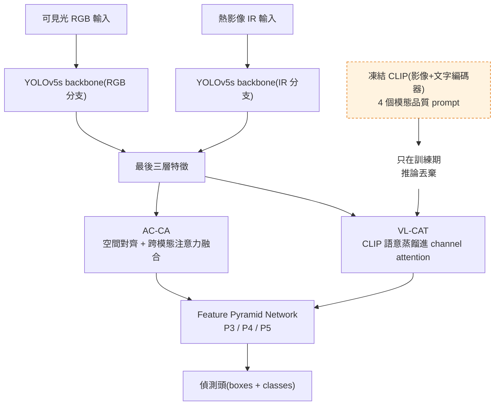
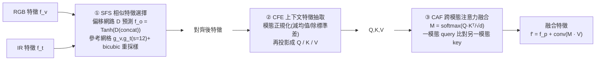
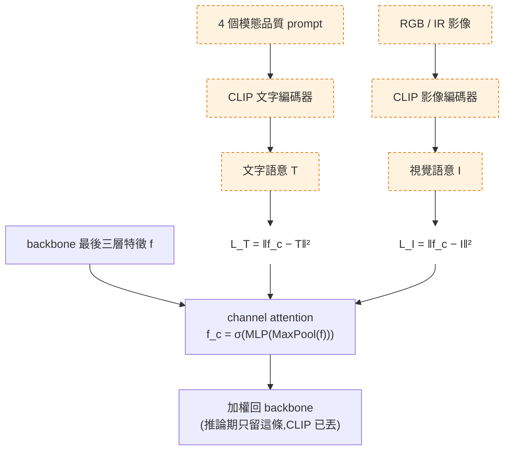

# 一句話總結 (TL;DR)
**VL-ACFDet** = 雙流 YOLOv5、mid-fusion 的多光譜(可見光 RGB + 熱影像 IR)偵測,兩個新模組:
- **AC-CA(Adaptive Cross-Contextual Attention)**:先把兩模態**空間對齊**(SFS 預測偏移 + bicubic 重採樣)、**分布正規化**(CFE),再做**跨模態注意力融合**(CAF)。副作用:**參數反而變少、FPS 反而變快**。
- **VL-CAT(Vision–Language-guided Channel Attention Transfer)**:用**凍結的 CLIP**(影像+文字編碼器)當老師,以 4 個「模態品質」prompt 產生語意訊號,**L2 蒸餾**進 backbone 最後三層的 **channel attention**。關鍵:**CLIP 只在訓練期跑,推論期整個退場——無 CLIP 級開銷**(留下的輕量通道分支 +3.6% 參數、−0.6 FPS,見消融)。

M³FD **86.67% mAP**(All)、自建惡劣天候資料集全面領先第二名,**Adverse 子集尤其強**(M³FD 84.58%)。

---

# 2. ★ 問題定義與核心觀點

**任務**:智慧車在**惡劣天候 / 低光**下的多光譜物件偵測——RGB 提供色彩紋理但天候一差就退化,IR 在惡劣條件仍可靠,需有效融合。

**痛點(本文靶心)**:現有融合與 **illumination-aware** 網路「**用不好、也分不清**」模態專屬資訊——
- illumination-aware(如 MBNet)只靠**可見光照度**決定模態權重;但雨/霧/雪會讓照度誤判模態優先序,且忽略**熱影像本身的品質**(前景/背景溫差小時 IR 也沒資訊)。
- 純 transformer 動態融合(如 CFT)**只靠深度學習、缺先驗知識**,又直接吃 raw 模態 → 冗餘多、算力高。

**核心觀點**:引入 **VLFM(CLIP)當語意先驗**。CLIP 在海量圖文對上預訓,能**跨模態判斷「哪個模態此刻可信」**,減少對單一模態的過度依賴(Fig. 1:CLIP 對「惡劣天候的可見光」以 98% 信心判為 adverse、對「清晰的熱影像」以 100% 信心判為 clear object)。把這個語意訊號拿來**引導融合**,就能動態校準模態互補性。


*論文 Fig. 1:CLIP 以 zero-shot 分類評估模態品質——左=惡劣天候的可見光,CLIP 高信心(~0.99)判為「adverse condition」;右=清晰的熱影像,高信心判為「clear objects」。這證明 CLIP 能跨模態辨識「此刻哪個模態可信」,正是 VL-CAT 拿它當融合先驗的依據。*

---

# 3. 方法核心

## 整體架構
雙流 YOLOv5s(RGB 分支 + IR 分支),**mid-fusion**;**AC-CA 與 VL-CAT 都接在兩分支的「最後三層」**,增強後的特徵送 FPN(P3/P4/P5)→ 偵測頭。



*橘色虛線 = 只在訓練期存在的路徑。推論時 CLIP 整個拿掉,只留被蒸餾好的 channel attention 權重,所以零額外算力。*


*論文 Fig. 2:VL-ACFDet 完整架構。雙流 YOLOv5(藍=可見光、紅=熱影像),**AC-CA(綠)與 VL-CAT(橘)在最後三個尺度交錯插入**;上下的 CLIP(❄ 凍結)以文字 prompt 供語意,匯到 P3/P4/P5 → 偵測頭。🔥Tunable / ❄Frozen 標示訓練/凍結——CLIP 全凍且僅訓練期(對照上方 mermaid)。*

## 模組一:AC-CA(三個 block)
把「對齊 → 正規化 → 融合」拆成 SFS、CFE、CAF:



- **SFS(Similarity Feature Selection)**:RGB 與 IR 常**空間未對齊**。SFS 用偏移網路 $D$ 預測像素位移 $f_o=\mathrm{Tanh}(D(\mathrm{Concat}(f_v',f_t')))$,配參考網格 $g_v,g_t$(下採樣率 $s=12$,論文實測平衡算力與解析度)與 **bicubic 插值**重採樣 → 對齊特徵。**這是 Bridging 沒有的顯式空間對齊。**
- **CFE(Contextual Feature Extractor)**:直接對未校準的模態做 self-attention 會被**模態偏差**拖累。CFE 先做**模態正規化**(對齊兩模態的特徵分布),再經卷積投影成融合用的 $Q,K,V$。
- **CAF(Cross-modal Attention Fusion)**:$M^t=\mathrm{softmax}(f_Q^t (f_K^v)^\top/\sqrt d)$、$M^v=\mathrm{softmax}(f_Q^v (f_K^t)^\top/\sqrt d)$ —— **用一個模態的 query 去比對另一個模態的 key**,再把注意力加權到對方的 value 上注入互補資訊:融合輸出 $=$ 自身正規化特徵 $+\;\mathrm{conv}(M\cdot V)$。

> 消融亮點:**AC-CA 取代標準 transformer 後,精度上升、參數從 44.5M → 34.7M、FPS 47.1 → 52**(SFS 去冗餘的功勞)。融合模組不必然增算力——對邊緣是好消息。


*論文 Fig. 3:AC-CA 三段。左 **SFS**(相似特徵選擇:Conv/GELU/Tanh 出偏移 $f_o$ + Grid-Sample 對齊兩模態);中 **CFE**(可見光/熱影像各自 Norm + Mean/Std 正規化,投影出 $Q/K/V$);右 **CAF**(MatMul 出跨模態相似度 $M^t、M^v$,加權融合出 $f_i^{v'}、f_i^{t'}$)。對應本節三個 block。*

## 模組二:VL-CAT(CLIP 蒸餾,訓練期限定)
把 CLIP (ICML 2021) 的跨模態語意當老師,蒸餾進 backbone 的 channel attention,壓低低語意特徵、放大高語意特徵。



**四個 prompt(逐字)** —— 把「模態此刻好不好」變成 CLIP 可打分的語意:
1. `"a visible image in clear weather conditions"`
2. `"a visible image in adverse weather conditions"`
3. `"a thermal image with clear objects and visible details"`
4. `"a thermal image without clear objects"`

- backbone 最後三層各接一個 **channel-wise attention** 分支:$f_c=\sigma(\mathrm{MLP}(\mathrm{MaxPool}(f)))$($\sigma$=sigmoid)。
- **L2 蒸餾**:讓 $f_c$ 逼近 CLIP 的文字語意($L_T$)與視覺語意($L_I$),兩者平均後合併。
- **CLIP 全程凍結、且只在訓練期用** → 推論時整個 CLIP 拿掉、不需額外資料。⚠️ 精確說是「**無 CLIP 級負擔**」而非絕對零開銷:channel attention 分支推論期照跑(Table 3:參數 +3.6%、FPS 47.1→46.5)。


*論文 Fig. 4:VL-CAT。文字 prompt → Text Encoder、影像 → Image Encoder,各出 $(512,1)$ 語意(經 Adapter);backbone 三尺度 $(128,80,80)/(256,40,40)/(512,20,20)$ 壓成通道向量,以虛線 **Loss(L2)** 向 CLIP 的文字/視覺語意對齊。CLIP 全凍、僅訓練期,推論只留學好的通道注意力。*

## 聯合損失
標準 YOLO 偵測損失(分類 $L_c$、objectness $L_o$、$L_{CIOU}$)+ 兩個蒸餾損失聯合訓練:

$$L_{\text{VL-ACFDet}} = \lambda_o L_o + \lambda_c L_c + \lambda_{CIOU} L_{CIOU} + \lambda_T L_T + \lambda_I L_I$$

權重:$\lambda_o=1,\ \lambda_c=0.5,\ \lambda_{CIOU}=0.05,\ \lambda_T=0.1,\ \lambda_I=0.1$。

---

# 4. 實驗結果

## 設定
雙流架構參考 CFT([ref 6],arXiv:2111.00273)、以 **YOLOv5s** 為基;部分層用 MS-COCO 預訓權重、其餘隨機。PyTorch,**RTX 6000 Ada**(主實驗)/ **RTX 4090**(消融),batch 32,Adam(初始 lr 0.01、final 0.002、momentum 0.937、weight decay 5e-4),One-Cycle。M³FD 訓 300 epochs(~16h);自建資料集 100 epochs(~7.5h)。指標 mAP@{50, 75, 50:95}。

## 資料集
| 資料集 | pairs | boxes | 備註 |
|---|---:|---:|---|
| **M³FD**([ref 16]) | 4200 | 33,603 | 標準多模態 benchmark;split 用 Liang et al.([ref 17]):3368 訓 / 832 測 |
| **自建資料集(論文團隊車載擷取)** | **43,420** | **132,905** | 640×480、空間對齊 + 時間同步;行人/車/機車;80/20 split;**日/夜 + 雨霧**,比 M³FD 更廣更難;基於 [ref 4] 擴充 |


*論文 Fig. 5:自建資料集的實驗車平台——車頭可見光相機(紅)+ FLIR 熱像儀(藍),相距 3 cm、離地 68 cm;兩側為日/夜/雨/霧樣本場景(左熱影像、右可見光)。*

## M³FD(Table 1,節選)
| Method | Year | All | Day | Night | **Adverse** |
|---|:--:|--:|--:|--:|--:|
| CFT | 2022 | 82.24 | 79.54 | 91.38 | 76.0 |
| ICAFusion (PR 2024) | 2024 | 84.55 | 82.58 | 93.85 | 79.26 |
| Fusion-Mamba | 2024 | 85.0 | — | — | — |
| **VL-ACFDet(本文)** | 2024 | **86.67** | 83.79 | **95.80** | **84.58** |

> All **+6.17%** vs TarDAL(early fusion)、 **+4.78%** vs QFDet(late fusion);vs 其他 mid-fusion 增益 1.6%~10.1%。**Adverse 84.58% 最高**,勝 illumination-aware 的 UA-CMDet——歸功 VL-CAT 的 VLFM 語意。(注:TarDAL、Fusion-Mamba 為**引用原論文值、非重跑**,原表有 * 註記。)

## 自建資料集(Table 2)
本文 All **79.42**、Day 68.33、Night 81.58、Adverse 62.93,較第二名(ICAFusion 77.25)**All +2.17 / Day +4.19 / Night +1.87 / Adverse +2.95**。
類別 AP(Table 2):**行人 76.30、機車 81.99、汽車 79.96**。⚠️ 原文誤植:正文寫 "cars, pedestrians, and motorcycles = 76.30 / 81.99 / 79.96",與表格欄序(Person / Motor / Car)**錯位——以表格欄名為準**。

## 消融(Table 3,自建資料集)
| 設定 | mAP50 | mAP75 | mAP50:95 | Params | FPS |
|---|--:|--:|--:|--:|--:|
| Visible only | 73.4 | 42.7 | 43.3 | 7.0M | 123.5 |
| Thermal only | 65.6 | 28.8 | 34.2 | 7.0M | 123.5 |
| Baseline(CFT) | 75.91 | 40.77 | 42.19 | 44.5M | 47.1 |
| + AC-CA | 77.89 | 44.91 | 44.98 | **34.7M** | **52** |
| + VL-CAT | 78.39 | 46.14 | 45.87 | 46.1M | 46.5 |
| **AC-CA + VL-CAT(完整)** | **79.42** | **47.84** | **47.07** | 36.3M | 47.6 |

- **AC-CA**:精度↑ + **參數↓(44.5→34.7M)+ FPS↑(47→52)** ——SFS 去冗餘,融合反而更省。
- **VL-CAT**:vs baseline **+2.48 / +5.37 / +3.68**(mAP50/75/50:95),**mAP75 提升最大 → 融合品質主要改善定位精度**;參數 +3.6%(44.5→46.1M)、FPS −0.6——**CLIP 級成本為零**(訓練期限定),通道分支留在推論。
- Thermal-only 最差 → 印證「單靠 IR 不夠、要融合」。

---

# 5. 我的快速理解模型 (Mental Model)
把 VL-ACFDet 想成「**兩位證人 + 一位訓練班講師**」:
- **兩位證人** = RGB 與 IR。天候一差,可見光證人講話就不可靠。
- **AC-CA = 先幫兩位證人「對筆錄」**:SFS 把兩人講的同一件事**對齊時間軸**(空間對齊),CFE **統一口徑**(正規化),CAF 讓兩人**互相補話**(跨模態注意力)。
- **VL-CAT = 一位只在受訓時到場的講師(CLIP)**:考前(訓練)不斷提醒「這張可見光是惡劣天候、別太信」「這張熱影像很清楚、多聽它的」,把判斷力**內化進學生的注意力**;正式出庭(推論)時講師不到場,學生已經學會——**零額外成本**。

---

# 引用
```
@article{chen2025vlacfdet,
  title={Vision--Language-Guided Adaptive Cross-Modal Fusion for Multispectral Object Detection Under Adverse Weather Conditions},
  author={Chen, Yung-Yao and Jhong, Sin-Ye and Lin, Hsin-Chun and Wu, Yi-Chen},
  journal={IEEE MultiMedia},
  volume={32},
  number={2},
  pages={22--32},
  year={2025},
  note={Foundation Models for Multimedia},
  doi={10.1109/MMUL.2025.3525559}
}
```
