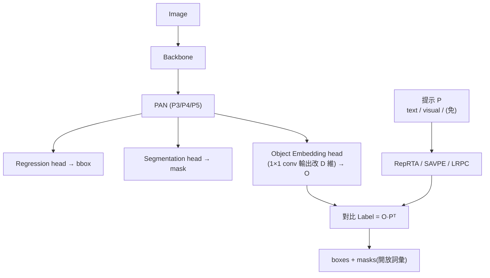
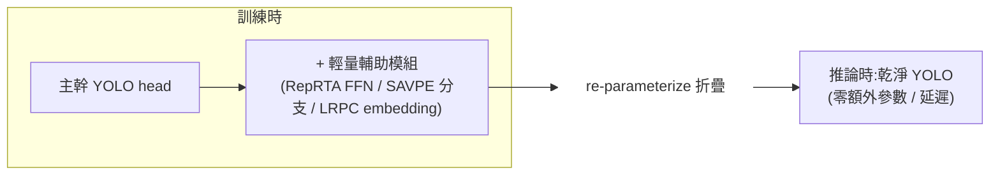

# 一句話總結 (TL;DR)
> **YOLO 系「開放詞彙 + 即時 + 判別式」的集大成** —— 一個 YOLOv8 模型同時支援 **text / visual / prompt-free** 三種提示,做開放詞彙**偵測 + 分割**。三個模組(RepRTA/SAVPE/LRPC)都設計成**訓練時輔助、推論時 re-parameterize 折疊掉 → 零推論開銷**。LVIS 上比 YOLO-World (CVPR 2024)v2 **+3.5 AP、訓練成本 1/3、推論 1.4×**(Table 1)。可視為 YOLO-World head 的直接升級,且 prompt-free 模式不依賴 LLM。

---

# 1. 架構總覽

建立在 **YOLOv8**(另用 YOLO11 驗證):backbone + PAN + 三個頭 —— **regression head**(bbox)、**segmentation head**(prototype + mask 係數,類 YOLACT/YOLOv8-Seg)、**object embedding head**。

> **關鍵改造:object embedding head**。它沿用 YOLO 分類頭結構,只把最後 $1{\times}1$ conv 的輸出通道**從「類別數 $C$」改成「embedding 維度 $D$」**。於是每個 anchor point 吐出一個 $D$ 維 object embedding $\mathcal O$,再和提示編出的 prompt embedding $\mathcal P$ 做對比:

$$\text{Label} = \mathcal O \cdot \mathcal P^T:\ \mathbb R^{N\times D}\times \mathbb R^{D\times C}\to \mathbb R^{N\times C} \quad (N=\text{anchor 數}, C=\text{提示數})$$

三種提示只是「$\mathcal P$ 怎麼來」的不同:text→RepRTA、visual→SAVPE、prompt-free→LRPC。




*圖:YOLOE 架構總覽。共用 YOLO backbone + PAN(P3/P4/P5),接 Segmentation / Regression / Object Embedding 三個頭;object embedding $\mathcal O$ 與 prompt embedding $\mathcal P$ 做 Label $=\mathcal O\cdot\mathcal P^{T}$。三種提示分別對應右下 **RepRTA**(text:Text Encoder → 輔助網路 $f_\theta$ → re-parameterization)、左下 **SAVPE**(visual:Activation + Semantic 雙分支)、右上 **LRPC**(prompt-free:specialized embedding → 內建詞彙 retrieval)。*

---

# 2. 零推論開銷的核心精神(三模組共通)

三個提示模組都遵循同一設計:**訓練時掛輔助網路強化,訓練後 re-parameterize 折疊回主幹**,推論時就是一個乾淨 YOLO。



---

# 3. 三模組深入

## ① RepRTA — text prompt(Re-parameterizable Region-Text Alignment)
**痛點**:文字↔物件 embedding 的對齊決定準確度;先前用複雜 cross-modality fusion,文字一多就貴。

**做法**:
1. CLIP text encoder 得 pretrained 文字 embedding $P=\text{TextEncoder}(T)$。**訓練前先 cache 所有文字 embedding → text encoder 可整個移除,零額外訓練成本**。
2. 掛一個**輕量輔助網路 $f_\theta$(只有一個 SwiGLU FFN block)**,精煉文字 embedding:$\mathcal P = f_\theta(P)\in\mathbb R^{C\times D}$,與 anchor object embedding 對比,強化對齊。
3. **訓練後 re-parameterize**:把 $f_\theta$ 折進 object embedding head 的最後 conv,新 kernel
$$K' = R_{C\times D\to C\times D'\times 1\times 1}(f_\theta(P))\circledast K^T$$
   最終 $\text{Label}=I\circledast K'$,**與原 YOLO 架構完全相同 → 零部署/遷移開銷**。

> 一句話:訓練時用一個 SwiGLU FFN 把 CLIP 文字 embedding「調準」,訓完把它折進主頭,推論零成本。**消融(Table 5):+RepRTA 帶來 +2.3 AP,零推論開銷。**

## ② SAVPE — visual prompt(Semantic-Activated Visual Prompt Encoder)
**痛點**:visual prompt(用 box/mask 指定「找長這樣的」)先前用 transformer-heavy 或額外 CLIP encoder,部署難。

**做法:解耦兩個輕量分支**:
- **語意分支(Semantic)**:輸出 **prompt-agnostic** 的語意特徵 $S\in\mathbb R^{D\times H\times W}$(不融合 visual cue,用 {P3,P4,P5} 各 $3{\times}3$ conv + upsample + concat 投影)。
- **激活分支(Activation)**:把 visual prompt 形式化成 mask(指定 region=1、其餘=0),經 conv 與 image features 融合 → **prompt-aware weights** $\mathcal W\in\mathbb R^{A\times H\times W}$,在 prompt region 內 softmax normalize。
- 把 $S$ 的通道分成 $A$ 組(每組 $D/A$ 通道),第 $i$ 組共享 $\mathcal W$ 的第 $i$ 通道權重,聚合成 prompt embedding:$\mathcal P=\text{Concat}(G_1,...,G_A)$。因 $A\le D$,**在低維處理 visual cue,成本極低**。

> 一句話:語意分支給「是什麼」的通用特徵、激活分支給「在哪、多重要」的權重,兩者低維聚合成 visual embedding,**不用 transformer**。**消融(Table 6):SAVPE 比單純 mask pooling +1.5 AP;$A{=}16$ 最佳平衡。**
> **用途**:對「講不出名字」的專門領域目標特別有用(text prompt 描述不出時)。


*圖:RepRTA 輔助網路與 SAVPE 分支結構。(a) RepRTA 的輔助網路 $f_\theta$ 就是一個 SwiGLU FFN(雙 Linear 分支經逐元素相乘 $\odot$ 再 Linear),把文字 embedding $P$ 精煉成 $\mathcal P$。(b) SAVPE 雙分支:**語意分支**對 {P3,P4,P5} 各兩層 $3{\times}3$ conv + upsample + concat + $1{\times}1$,輸出 prompt-agnostic 語意特徵 $S\in\mathbb R^{D\times H\times W}$;**激活分支**把 visual prompt 與各層 $1{\times}1$ image 特徵融合成 prompt-aware 權重 $\mathcal W\in\mathbb R^{A\times H\times W}$,兩者 Aggregation 為 visual prompt embedding。*

## ③ LRPC — prompt-free(Lazy Region-Prompt Contrast)
**痛點**:prompt-free 要找出**所有**物件並命名;先前用 language model 生成類別名(GRiT 用 FlanT5、DINO-X 用 OPT),開銷大。

**做法:reformulate 成 retrieval 問題**:
1. 訓一個 **specialized prompt embedding $\mathcal P_s$**(專門找「所有物件」),配一個**內建大詞彙**(tag list,涵蓋各類別)當檢索源。
2. 先用 $\mathcal P_s$ 濾出「有物件」的 anchor 子集:$\mathcal O'=\{o\in\mathcal O \mid o\cdot\mathcal P_s^T > \delta\}$。
3. **只對 $\mathcal O'$(有東西的 anchor)** lazy 比對內建詞彙取類別名,跳過大量無關 anchor → 避免「所有 anchor × 大詞彙」的全比對。

> 一句話:先用一個「萬物」embedding 濾出有東西的 anchor,只對這些去大詞彙查名字(lazy),**不勞駕 LLM**。**消融(Table 7):$\delta$ 可調速度-精度,$\delta{=}10^{-2}$ 時 YOLOE-v8-S 得 1.9× 加速、僅 0.2 AP drop。**

---

# 4. 實驗結果

## LVIS zero-shot 偵測(Table 1,Fixed AP @ minival,T4 GPU)

| 模型 | Params | 訓練 | FPS(T4) | AP | AP_r | AP_c | AP_f |
|---|---:|---:|---:|---:|---:|---:|---:|
| YOLO-Worldv2-S | 13M | 41.7h | 216.4 | 22.7 | 17.1 | 22.5 | 27.3 |
| **YOLOE-v8-S** | 12M | **12.0h** | **305.8** | **27.9** | 22.3 | 27.8 | 29.0 |
| YOLO-Worldv2-L | 48M | 80.0h | 80.0 | 35.5 | 25.6 | — | — |
| **YOLOE-v8-L** | 45M | **22.5h** | 102.5 | **35.9** | **33.2** | 34.8 | 34.6 |

- vs YOLO-Worldv2-S/M/L:**+3.5 / +0.2 / +0.4 AP**,推論 **1.4× / 1.3× / 1.3×**(T4),訓練**省 3×**。
- **rare 類(AP_r)增益最大**(v8-S/L +5.2% / +7.6%)—— 開放詞彙的長尾正是價值所在。
- YOLO11 版(YOLOE-11-S/M/L)亦有 favorable 表現。


*圖:YOLOE(橘)vs YOLO-Worldv2(藍)的「性能–訓練成本–推論效率」三面對比(縱軸皆為 LVIS AP)。左:訓練時間 **3× 更短**;中:TensorRT 下 FPS **1.4× 加速**;右:CoreML(端側)下 FPS **1.3× 加速**。YOLOE 三張圖皆落在左上/右上(更省成本、更高精度、更快推論),全面優於 YOLO-World。*

## 分割(Table 2,LVIS val,AP^m,zero-shot)
- YOLOE-v8-M/L:**20.8 / 23.5 AP^m**(zero-shot),**勝**在 LVIS-Base 上 fine-tuned 的 YOLO-Worldv2-M/L **+3.0 / +3.7**。

## Prompt-free(Table 3)
- YOLOE-v8-L:**27.2 AP**,勝 GenerateU(Swin-L)+0.4 AP,且**參數少 6.3×、推論快 53×**。

## COCO 下游遷移(Table 4)
- **Linear probing**:YOLOE-11-M/L 用 **<2% 訓練時間**達 YOLO11-M/L **80%+** 性能。
- **Full tuning**:YOLOE-v8-L 達 **52.6 AP^b**,比 closed-set YOLOv8-L **+0.6 AP^b**,且訓練 epoch **少 ~4×**。

## 四種推論場景(定性結果)


*圖:YOLOE 四種推論場景(偵測 + 分割 mask 齊出)。(a) LVIS zero-shot:以完整 LVIS 詞彙偵測並分割。(b) 自訂 text prompt:只找指定類別(white hat / sunglasses / red hat / mustache / tie / white car)。(c) visual prompt:用紅色虛線框指定一台筆電為範例 → 找出畫面中所有同類目標(SAVPE)。(d) prompt-free:無需提示自動標出萬物(cloud / sky / airplane / trailer truck / traffic cone …,LRPC)。*

---

# 5. 消融:從 YOLO-World 一步步到 YOLOE(Table 5,roadmap)

| 步驟 | AP | 備註 |
|---|---:|---|
| YOLO-Worldv2-L(baseline) | 33.0 | 起點 |
| 減訓練 epoch 到 30 | 31.0 | 省算力 |
| + global negative dict | 31.9 | 更多樣負樣本 |
| − cross-modal fusion | 30.0 | **−1.9 AP,但 1.28× 加速**(去掉貴的視覺-文字融合)|
| + MobileCLIP-B(LT) encoder | 31.5 | 更強文字 embedding,recover |
| **+ RepRTA** | **33.5** | **+2.3 AP,零推論開銷** |
| + Segmentation head | 33.3 | −0.2 AP(多任務代價),換得**分割能力** |

> 這張表講清了 YOLOE 的省法:**砍掉貴的 cross-modal fusion(換來速度)→ 用更強 CLIP + RepRTA 把精度補回來還超越**。SAVPE(Table 6)、LRPC(Table 7)另有獨立消融。

---

# 6. 我的快速理解模型 (Mental Model)

把 YOLOE 想成「**一台會三種問法、但考試時拆掉外掛的即時偵測機**」:
- **YOLOv8** = 跑很快但只認固定類別。
- **三個外掛耳朵**:文字耳(RepRTA,你講「找貓」)、看樣本耳(SAVPE,你指一張圖「找長這樣的」)、免提示耳(LRPC,它自己把認得的全標出來、不找 LLM)。
- **關鍵**:三個耳朵**只在訓練時裝、考試(推論)時 re-param 折進腦袋** → 跑起來還是那台飛快的 YOLO。
- **省訓練的秘訣**(Table 5):先砍掉最貴的 cross-modal fusion 換速度,再用更強 CLIP + RepRTA 把準度補回來、還反超。

---

# 引用
```
@inproceedings{wang2025yoloe,
  title={YOLOE: Real-Time Seeing Anything},
  author={Wang, Ao and Liu, Lihao and Chen, Hui and Lin, Zijia and Han, Jungong and Ding, Guiguang},
  booktitle={ICCV},
  year={2025}
}
```
