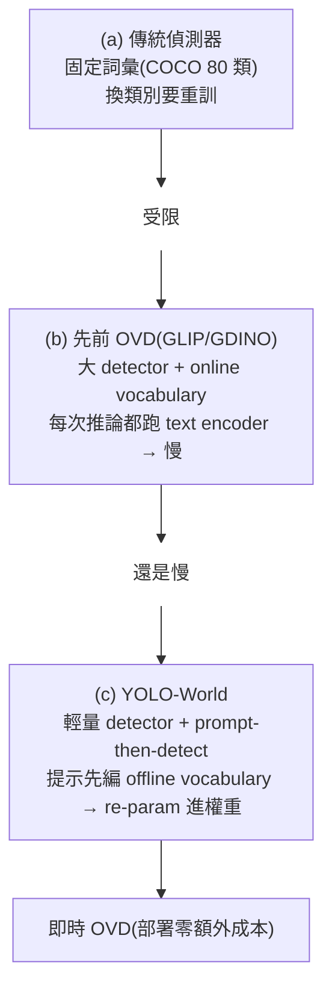
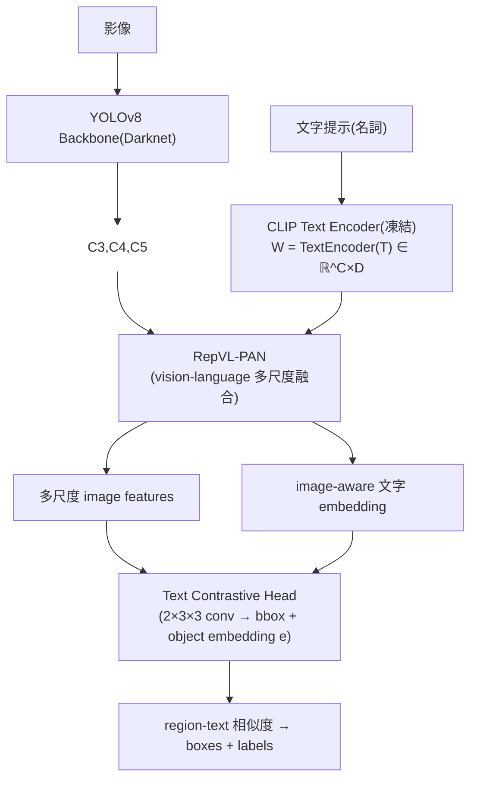

# 一句話總結 (TL;DR)
> **YOLOv8 + CLIP text encoder + 重新設計的 vision-language PAN(RepVL-PAN)** —— **第一個即時開放詞彙偵測器**,LVIS **35.4 AP**、re-param 後 **52 FPS**(V100),比 Grounding DINO **+8 AP、快 35×**。核心創新是 **prompt-then-detect** 範式:提示先編成 offline vocabulary、**re-parameterize 進模型權重**,推論零額外成本。**Bridging 直接用它的 detection head;它也是 YOLOE (ICCV 2025) 的前身、你即時頭三選一的基準**。

---

# 2. 核心範式:prompt-then-detect(三種偵測範式對比)



> **關鍵洞察**:先前 OVD 慢,是因為推論時文字和影像**同時編碼**(online vocabulary)。YOLO-World 把它拆開:**先**把使用者的提示編成固定的 offline vocabulary(**prompt**),**再**當成普通 YOLO 的分類權重去偵測(**detect**)。詞彙固定後,整個 vision-language 融合可 **re-parameterize** 成卷積/線性層權重 → 推論就是一台乾淨 YOLO。

---

# 3. 方法核心

## 整體架構



- **YOLO detector**:YOLOv8(Darknet backbone + PAN + head)。
- **Text Encoder**:CLIP 文字編碼器(**凍結**),$W=\text{TextEncoder}(T)\in\mathbb R^{C\times D}$($C$=名詞數)。用 **n-gram** 從 caption 抽 noun phrases。CLIP 比純文字 encoder 更能連結視覺(§消融證實)。
- **Text Contrastive Head**:decoupled head + 兩個 $3{\times}3$ conv,回歸 bbox 與 object embedding $e_k$;region-text 相似度
$$s_{k,j} = \alpha\cdot \text{L2Norm}(e_k)\cdot \text{L2Norm}(w_j)^T + \beta$$
  (affine 的 scaling $\alpha$ + shifting $\beta$ 對穩定 region-text 訓練很重要)。

## RepVL-PAN — 雙向 vision-language 融合(核心)
建立在 YOLOv8 PAN(top-down + bottom-up)的金字塔 $\{P_3,P_4,P_5\}$,插入兩個**雙向**融合模組:

### ① T-CSPLayer(Text-guided CSPLayer)—— 文字 → 視覺
把文字 guidance 注入視覺特徵(擴展 YOLOv8 的 C2f)。在 dark bottleneck 後用 **max-sigmoid attention** 聚合文字:
$$X_l' = X_l \cdot \delta\!\Big(\max_{j\in 1..C}(X_l W_j^T)\Big)^T,\quad \delta=\text{sigmoid}$$
(對每個視覺位置,取「與所有文字最像的那個」的 sigmoid 當 gate,再乘回視覺特徵;$X_l'$ concat 到 cross-stage 輸出)→ **讓視覺特徵 condition on 類別文字**。

### ② I-Pooling Attention(Image-Pooling Attention)—— 視覺 → 文字
反向:用視覺更新文字 embedding,讓文字「看到」這張圖。對多尺度特徵 max pooling 成 $3{\times}3$ regions、共 **27 個 patch token** $\tilde X\in\mathbb R^{27\times D}$,再:
$$W' = W + \text{MultiHead-Attention}(W, \tilde X, \tilde X)$$
→ **image-aware 的文字 embedding**(不同圖給不同文字表示)。

> **雙向**:T-CSPLayer 讓「視覺懂文字」、I-Pooling 讓「文字懂這張圖」。**推論時 offline vocabulary 固定 → 這些融合可 re-parameterize 成 conv/linear 權重**,零開銷。

## 訓練:region-text contrastive + 三類資料混訓
- **online vocabulary**(訓練時):每個 mosaic(4 圖)抽 positive nouns + 隨機採 negative nouns,每 sample 最多 $M{=}80$ nouns。
- **loss**:region-text contrastive $\mathcal L_{con}$(cross-entropy)+ IoU + distributed focal(bbox):
$$\mathcal L = \mathcal L_{con} + \lambda_I\cdot(\mathcal L_{iou}+\mathcal L_{dfl})$$
  $\lambda_I{=}1$ 當 detection/grounding 資料、$\lambda_I{=}0$ 當 image-text 資料(因後者 box 是 pseudo、noisy,不算回歸 loss)。
- **三類資料**:Objects365(detection)+ GoldG(GQA/Flickr,grounding)+ CC3M(image-text)。
- **pseudo labeling(image-text)**:3 步 —— ① n-gram 抽 noun phrases → ② 用 GLIP 生 pseudo boxes → ③ CLIP 過濾 relevance + NMS。從 CC3M 246k 圖生 **821k pseudo annotations**。

---

# 4. 實驗結果

## LVIS zero-shot(Table 2,Fixed AP @ minival,V100)
括號內 = 原版(含 RepVL-PAN),括號外 = **re-parameterized 版**(部署版):

| 模型 | Params | FPS | AP | AP_r | AP_c | AP_f |
|---|---:|---:|---:|---:|---:|---:|
| GLIP-T | 232M | 0.12 | 26.0 | 20.8 | 21.4 | 31.0 |
| Grounding DINO-T | 172M | 1.5 | 27.4 | 18.1 | 23.3 | 32.7 |
| DetCLIP-T | 155M | 2.3 | 34.4 | 26.9 | 33.9 | 36.3 |
| **YOLO-World-S** | **13M**(77M) | **74.1**(19.9) | 26.2 | 19.1 | 23.6 | 29.8 |
| **YOLO-World-L** | **48M**(110M) | **52.0**(17.6) | 35.0 | 27.1 | 32.8 | 38.3 |
| **YOLO-World-L**(+CC3M) | 48M | 52.0 | **35.4** | **27.6** | 34.1 | 38.0 |

- **re-param 的威力**:YOLO-World-S 從 77M/19.9 FPS → **13M/74.1 FPS**(參數少 6×、快 3.7×),AP 幾乎不變。
- YOLO-World-L **35.4 AP** 超越 DetCLIP-T,**推論快 ~20×**;比 Grounding DINO-T **+8 AP、快 35×**。

## 消融
- **pre-train 資料(Table 3)**:O365 23.5 → **+GQA 31.9(+8.4!)** → +GoldG 32.5 → +CC3M 33.0。**富文字的 grounding 資料(GQA)增益最大**。
- **RepVL-PAN(Table 4)**:比純 YOLOv8-PAN,O365 上 +1.1 AP、**O365+GQA 上 +2.2 AP** —— **文字越豐富,RepVL-PAN 越有效**;rare 類(AP_r)提升尤其明顯。
- **text encoder(Table 5)**:**CLIP-base frozen 22.4 AP** 遠勝 BERT-base frozen(14.6);**fine-tune CLIP 反而降到 19.3**(O365 只 365 類、文字不夠豐富,微調會破壞 CLIP 預訓練)→ **凍結 CLIP 是對的**。

## 遷移 / 分割
- **COCO fine-tune**:YOLO-World-L **53.3 AP**。
- **LVIS fine-tune(Table 7)**:YOLO-World-L 34.1 AP,勝 ViLD/RegionCLIP/Detic。
- **開放詞彙實例分割(OVIS)**:fine-tune 加 mask 分支,COCO→LVIS(80→1203)、LVIS-base→LVIS(866→1203)兩設定驗證(這條線後被 YOLOE (ICCV 2025) 的 YOLOE-Seg 統一)。

---

# 5. 我的快速理解模型 (Mental Model)

把 YOLO-World 想成「**會查字典的 YOLO,而且考試前先把字典背進腦**」:
- **YOLO 本體** = 快、輕、即時。
- **CLIP text encoder** = 一本字典(把類別名變成向量)。
- **RepVL-PAN** = 字典翻譯機,雙向:讓 YOLO「看圖時想著字典」(T-CSPLayer)、也讓字典「因這張圖微調」(I-Pooling)。
- **prompt-then-detect** = 考試前(部署前)先把要找的詞查好、**背進權重(re-param)**;考試時(推論)就是一台不用翻字典的飛快 YOLO。

---

# 引用
```
@inproceedings{cheng2024yoloworld,
  title={YOLO-World: Real-Time Open-Vocabulary Object Detection},
  author={Cheng, Tianheng and Song, Lin and Ge, Yixiao and Liu, Wenyu and Wang, Xinggang and Shan, Ying},
  booktitle={CVPR},
  year={2024}
}
```
