# 📖 給「看公式就頭暈」的你

> **這份不講創新、不講為什麼牛**,只回答一件事:
> **「一張圖丟進去,它怎麼一步步變成偵測結果?」**
>
> 全部用具體 shape + 日常比喻,公式只放最低限度。

> 💡 🎞 兩種更好讀的視圖(2026-06-10 新增)
> - **簡報模式**:[簡報版](slides.html) — 一頁一觀念,開 Advanced Slides 全螢幕翻頁讀
> - **架構地圖**:[架構地圖](map.html) — 可縮放的資料流走讀,每張卡連回本篇對應段落

---

# 🎯 Part 0:先確認你看的兩篇在做什麼

## 這兩篇的「I/O」(輸入輸出)

**Bridging RGB-IR**
```
輸入:
  ① RGB 影像  (3, 640, 640)         ← 普通彩色照片
  ② IR 影像   (1, 640, 640)         ← 熱感應圖,黑白
  ③ 文字 prompt: ["person", "car"]   ← 你想找什麼

輸出:
  bboxes: [(x1,y1,x2,y2), ...]      ← 框出來的位置
  labels: ["person", "car", ...]    ← 對應類別
  scores: [0.92, 0.87, ...]         ← 信心
```

**LLMDet**
```
輸入:
  ① RGB 影像  (3, 800, 800)
  ② 文字 prompt: ["dog", "frisbee", ...]

輸出:同上,bbox + label + score
(訓練時還會多吃 caption,但推論不用)
```

---

# 🧱 Part 1:先弄懂「最簡單的偵測器」(地基)

如果你連 YOLO / Faster R-CNN 都沒底,先看這段。已會可跳過。

## 1.1 先看懂 tensor shape 標記法

CV 論文都用 `(C, H, W)` 表示一個張量(影像 / 特徵):

```
(3, 640, 640)
 ↑   ↑    ↑
 │   │    └─ 寬度 (Width):640 像素
 │   └────── 高度 (Height):640 像素
 └────────── 通道 (Channels):3 個 (R/G/B)
```

### 🎯 想像成一疊紙

```
┌─────────────┐ ← R 通道 (640×640 數字,代表紅色強度 0~255)
│   ▒▒▒▒▒    │
├─────────────┤ ← G 通道 (640×640 數字,代表綠色)
│   ▒▒▒▒▒    │
├─────────────┤ ← B 通道 (640×640 數字,代表藍色)
│   ▒▒▒▒▒    │
└─────────────┘

3 張紙(通道)疊起來 = RGB 影像
每張紙都是 640×640 個數字
總共 3 × 640 × 640 = 1,228,800 個數字
```

---

## 1.2 一個普通偵測器的「資料流」

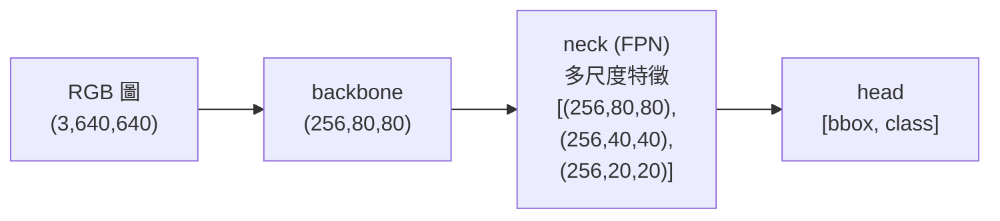

逐步看每個轉換在幹什麼。

---

## 1.3 為什麼 `(3, 640, 640)` 變成 `(256, 80, 80)`?

Backbone(CSPDarknet / ResNet / Swin)同時做**兩件事**:

### A. 縮小空間:640 → 80(縮 8 倍)
- 每 **8×8 個像素**被「**壓縮**」成 1 個位置
- 80 = 640 / 8

### B. 加深通道:3 → 256(加深 85 倍)
- 每個位置不再只記「R/G/B 三個值」
- 而是記「**256 個高層級特徵**」

```
原本:                       backbone 後:
(3, 640, 640)              (256, 80, 80)
每位置 3 維 = R/G/B         每位置 256 維 = 學到的抽象特徵
       │                          │
       ▼                          ▼
  「這像素紅色 128」          「這區域 80% 像狗、
                                有毛茸茸紋理、
                                位於邊緣、...」
```

### 🎯 比喻 — 衛星空照圖

| 階段 | 比喻 |
|---|---|
| **原始 RGB** `(3, 640, 640)` | 像素級空照圖,看每塊草地的綠色強度 |
| **Backbone 後** `(256, 80, 80)` | 鄉鎮級摘要 — 8×8 像素區域 → 一個「這裡是什麼」的綜合描述 |

| | 細節 | 語意 |
|---|---|---|
| RGB | 多(4K 解析) | 無(只是顏色) |
| Backbone 特徵 | 少(縮 8 倍) | 多(學到的概念) |

---

## 1.4 為什麼要三種解析度 `[(C,80,80), (C,40,40), (C,20,20)]`?

**因為一張圖裡物件大小差很多**。

```
一張街景圖裡可能有:
  🚌 公車 — 佔 400×300 像素 (超大)
  🚗 汽車 — 佔 200×150 像素 (中)
  🐦 飛鳥 — 佔 20×15 像素   (超小)
```

**問題**:單一解析度搞不定大小差距這麼大的物件。

### 三種解析度各看什麼?

| 解析度 | 每格代表多少像素 | 適合偵測 |
|---|---|---|
| **80×80**(高,P3) | 8×8 | 小物件(遠處的鳥) |
| **40×40**(中,P4) | 16×16 | 中等物件(汽車) |
| **20×20**(低,P5) | 32×32 | 大物件 + 高層語意(公車整體) |

### 直覺
- **抓鳥**:用 80×80(每格小,鳥不會被「壓進一個格子」)
- **抓公車**:用 20×20(20×20 格已足夠,且能看到「**整輛車的概念**」)

### FPN(Feature Pyramid Network)在幹嘛?
```
backbone 自然產生:        FPN 處理後:
P3 (80×80) 細節有,語意弱   P3' (80×80) 細節 + 語意都有 ✓
P4 (40×40) 中等            P4' (40×40) 中等 + 語意 ✓
P5 (20×20) 語意強,細節弱   P5' (20×20) 語意強 + 夠用細節 ✓
```

→ **不同大小的物件各自找適合的解析度去偵測**。詳見 08_FPN 與多尺度特徵。

---

## 1.5 完整資料流(以「黑暗中偵測一個人」為例)

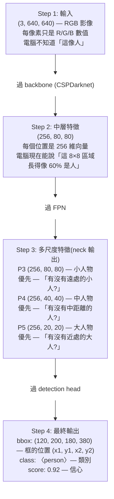

---

## 1.6 各模組的職責總結

| 模組 | 輸入 | 輸出 | 職責 |
|---|---|---|---|
| **Backbone** | RGB image | (C, H, W) 特徵圖 | 把像素 → 抽象特徵 |
| **Neck (FPN)** | backbone 中間多層 | 多尺度特徵 [(C,80,80), (C,40,40), (C,20,20)] | 重組多尺度 + 對齊語意 |
| **Head** | 多尺度特徵 | bbox + class | 每個位置預測物件 |

---

## 1.7 普通偵測器的瓶頸

**類別只能是訓練時看過的**(80 類 COCO 就是 80 個固定 class id)。換新類別 → 重訓。

→ 這就是為什麼後來有 **Open-Vocabulary Detection (OVD)** — 把固定分類頭換成「跟文字算 cosine 相似度」,類別可任意。詳見 Open-Vocabulary Detection (OVD) 任務全解。

---

## ✅ 自我檢驗(讀完試答)

1. `(256, 80, 80)` 第一個 256 是什麼意思?(通道 / 高 / 寬?)
2. 為什麼要用三種解析度,不用一種?
3. `(3, 640, 640)` → `(256, 80, 80)` 空間縮幾倍?通道加幾倍?
4. FPN 在偵測器哪個位置?它修補了什麼問題?

如果這 4 題都答得出來,你就懂了 90%,可以放心進 Part 2。

---

# 📦 Part 2:Bridging RGB-IR 整體架構鳥瞰

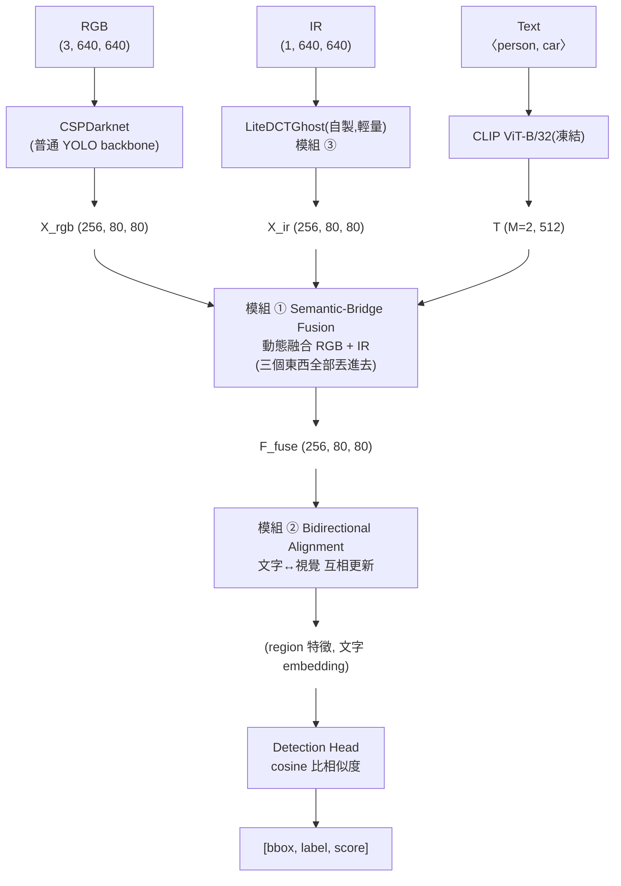

**先記三件事**:
1. **三條輸入線** → RGB / IR / Text,各自先變成特徵
2. **模組 ① 是核心** → 把三條線變成一個 "F_fuse"
3. **模組 ② 是錦上添花** → 讓文字跟視覺對齊得更好

如果你只記住這個,**60% 的論文你就懂了**。

---

# 🔬 Part 3:模組 ① Semantic-Bridge Fusion(超詳細版)

> **整篇論文最複雜的就這一塊**,搞懂這個其他都簡單。

## 3.0 它要解決的問題

```
你想:在「黑暗中有個人,前面停了一台車」的圖偵測「person, car」

普通 RGB-IR 融合(笨方法):
  RGB(黑黑的看不清) + IR(看到兩個熱點)
  → 直接 concat 後 conv 一下
  → 模型搞不清楚熱點是人還是車

問題:RGB 跟 IR 直接「視覺對視覺」溝通,沒有共同語言。
```

### 💡 本文方法 — 文字當「翻譯」
**「文字 prompt = 共同語言。RGB 跟 IR 各自跟文字對話,結果同步就更可信。」**

### 場景設定(後面所有 Step 都用這個)
- $X_{rgb}$ shape (256, 80, 80) — RGB 經 CSPDarknet 的特徵
- $X_{ir}$  shape (256, 80, 80) — IR 經 LiteDCTGhost 的特徵
- $T$       shape (2, 512) — CLIP 編 ["person", "car"] 出來

---

## 3.1 Step 1:文字變成「問題」,RGB / IR 變成「答案候選」

```
Q       = W_q · T            ← (2, 256) — 變成「問題」
K_rgb   = W^k_rgb(X_rgb)     ← (256, 80, 80) — RGB 的「答案候選」
K_ir    = W^k_ir(X_ir)       ← (256, 80, 80) — IR 的「答案候選」
```

### 🎯 比喻
- $T$ = CLIP 提供的「person、car」**通用概念**(像字典裡的定義)
- $Q$ = 把它翻譯成「**問題形式**」(從定義變成「我想找 person 在哪裡?」)
- $W_q$ = 翻譯機,把 512 維文字 → 256 維視覺維度
- $K_{rgb}$, $K_{ir}$ = RGB 跟 IR 各自的「**可被搜尋的特徵庫**」

### ⚠️ 關鍵設計
$Q$ **只算一次**,RGB 跟 IR 共用!這就是「橋」的意義 — **兩邊都被同一個問題 query**。

---

## 3.2 Step 2:算「文字對每個位置的響應」

```
A_rgb = σ(Q · K_rgb^T / √d)   shape (2, 6400)  ← 6400 = 80×80
A_ir  = σ(Q · K_ir^T  / √d)   shape (2, 6400)
```

### 💡 用人話講
- $A_{rgb}[0, :]$ = 6400 個分數,「**RGB 中每個位置像不像 person?**」
- $A_{rgb}[1, :]$ = 同上,問 car
- $A_{ir}$ 同理但是 IR 觀點

### 視覺化(假設只看 person)
```
A_rgb (在 RGB 上):           A_ir (在 IR 上):
80×80 熱力圖                  80×80 熱力圖
                              
. . . . . . . .              . . . . . . . .
. . . . . . . .              . . . . . . . .
. . [0.1] . . .              . . [0.8] . . .   ← 黑暗中的人
. . . . . . . .              . . . . . . . .
. . . . . . . .              . . . . . . . .
                              
RGB 黑黑的所以分數低          IR 熱影像看到所以分數高
```

### ⚠️ 為什麼用 sigmoid 而非 softmax?
**因為一張圖可能同時有 person 跟 car**!sigmoid 讓每個類別獨立判斷,不互斥。

---

## 3.3 ★ Step 3:Bi-Support 拆解(全文最關鍵!)

```
M_cons = A_ir · A_rgb         ← 共識 (consensus)
M_dis  = A_ir · (1 - A_rgb)   ← 差異 (discrepancy)
```

### 🎯 具體數字(以 "person" 為例)

**位置 A** — 一般場景(亮處有人,RGB 跟 IR 都看到):
- $A_{rgb}$ = 0.8(RGB 強烈覺得是人)
- $A_{ir}$  = 0.9(IR 也強烈覺得)
- $M_{cons}$ = 0.9 × 0.8 = **0.72** ← 共識**很強**
- $M_{dis}$  = 0.9 × (1 - 0.8) = 0.18 ← 差異弱

**位置 B** — 黑暗區域(IR 看到、RGB 看不見):
- $A_{rgb}$ = 0.1(RGB 看不清)
- $A_{ir}$  = 0.85(IR 看到熱訊號)
- $M_{cons}$ = 0.85 × 0.1 = 0.085 ← 共識**很弱**
- $M_{dis}$  = 0.85 × (1 - 0.1) = **0.765** ← 差異**很強**

### 💡 數學上的精彩之處
注意這個身分式:
$$A_{ir} = M_{cons} + M_{dis} = A_{ir}A_{rgb} + A_{ir}(1-A_{rgb})$$

→ **IR 的所有響應被「無損地」拆成兩部分**,沒丟資訊。

### 🎯 證人辦案比喻
```
場景:警察辦案
  RGB 證人 = 一般目擊者(黑暗看不見就無能)
  IR  證人 = 紅外攝影機(永遠在錄,但會誤判)

正常場景(雙證一致)→ M_cons 強 → 鐵證
黑暗場景(RGB 失效,IR 獨家)→ M_dis 強 → 可能是真線索,但要小心
```

---

## 3.4 Step 4:動態重校準 IR

```
X̃_ir = X_ir ⊙ (1 + β · M_cons) ⊙ (1 + α · M_dis)
                                              
β = 0.5(可學,主導訊號)
α = 0.5(可學,gate 訊號)
⊙ = 逐元素相乘 (element-wise)
```

### 用具體位置算

**位置 A**(共識強):
$$\tilde X_{ir}^A = X_{ir}^A \times (1 + 0.5 \times 0.72) \times (1 + 0.5 \times 0.18)$$
$$= X_{ir}^A \times 1.36 \times 1.09 = X_{ir}^A \times 1.48$$
→ IR 特徵被**強化 48%**

**位置 B**(差異強):
$$\tilde X_{ir}^B = X_{ir}^B \times (1 + 0.5 \times 0.085) \times (1 + 0.5 \times 0.765)$$
$$= X_{ir}^B \times 1.04 \times 1.38 = X_{ir}^B \times 1.43$$
→ IR 特徵被**強化 43%**(因為 α 信任這個差異訊號)

**位置 C**(背景,啥都沒響應):
$$\tilde X_{ir}^C = X_{ir}^C \times 1 \times 1 = X_{ir}^C$$
→ **不變!**

### 💎 為什麼用 `(1 + x)` 不是 `x`?

- 寫 `X_ir × β·M_cons`:沒響應的地方 = 0 × ... = **0,IR 特徵被抹掉**
- 寫 `X_ir × (1 + β·M_cons)`:沒響應的地方 = 1 × 1 = **1,IR 特徵保留**

→ 這個 `1 +` 是設計魂,**確保「沒響應就不改」**。

### α 的特殊角色 — gate(門控)
- 正常場景:M_dis 自然就小 → 影響小
- 退化場景:M_dis 大 → α 可學的決定要不要信
- **α 是模型自己學的「對差異訊號的信任度」**

---

## 3.5 Step 5:用校準後的 IR 反過來引導 RGB

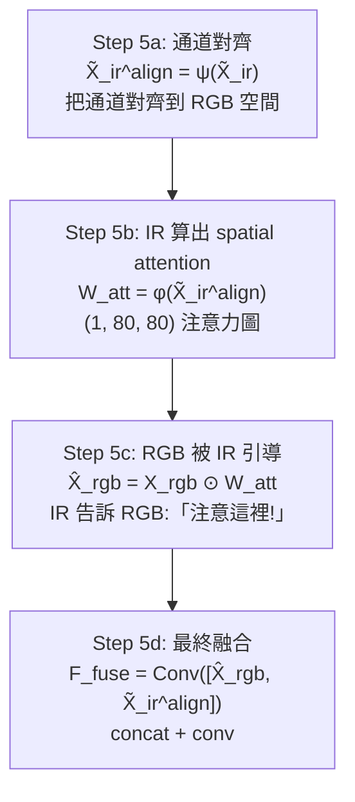

### 為什麼 IR 引導 RGB 而非反過來?
- **IR 在退化場景下更穩定**(熱訊號不受黑暗影響)
- 所以以 IR 為主、引導 RGB 補充細節是合理的

---

## 3.6 整個模組 ① 的邏輯圖

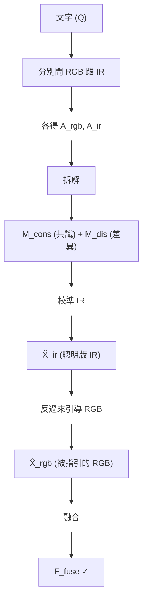

---

# 🔄 Part 4:模組 ② Bidirectional Alignment(超詳細版)

## 4.0 它要解決的問題

```
Module ① 出來的 F_fuse 是好的視覺特徵了。
但分類時我們要拿它跟「文字 embedding」算 cosine。

問題:文字 T 還是 CLIP 預訓練的「通用 person」概念
     你這張圖是「夜間瘦人」,T 沒對齊你的場景
     → 算 cosine 不準
```

### 💡 解法
**讓 vision 跟 text 在分類前互相更新一次**(雙向)。

---

## 4.1 Direction 1:Text → Vision(類別主動撈證據)

```
輸入:
  T (2, 256)             ← 文字 embedding(person, car)
  F_fuse (256, 80, 80)   ← Module ① 出來的視覺特徵

Cross-attention:
  Q_t = 文字
  K_v, V_v = F_fuse
  
A_{t→v} ∈ R^(2 × 6400)
  ↑       ↑
  類別數  視覺位置數
```

### 用人話講
**「每個類別 (person, car) 主動到視覺特徵中**撈**自己的證據區域」**

```
person 類別:                car 類別:
A_{t→v}[0, :] 是 6400 個權重  A_{t→v}[1, :] 是另一組 6400 個權重

→ 知道「找 person 該看圖的哪 N 個位置」
→ 知道「找 car 該看圖的哪 N 個位置」
```

### ⚠️ 方向選擇的精彩之處

| 方向 | 怎麼運作 | 後果 |
|---|---|---|
| **Text → Vision** ✓ | 類別當主考官,選 spatial 上有意義的點 | 乾淨!每類撈自己的證據 |
| Vision → Text ✗ | 每個 pixel 去 N 個類別中找最像的 | **背景 pixel 也 vote 把分數弄亂** |

→ 作者選 **t→v** — 「**讓類別主動撈,而非讓 pixel 投票**」。

---

## 4.2 Direction 2:Vision → Text(用視覺證據更新文字)

```
輸入:
  F_fuse 的多尺度 [P3, P4, P5]
  ← 各自 (256, 80, 80) / (256, 40, 40) / (256, 20, 20)

Step:
  U = Concat({Pool(P_i)}_{i=1}^3)   ← 各 pool 一個向量後 concat
  
更新文字:
  T̃ = update(T, U)   ← 通用文字 → 場景特化文字
```

### 💡 意義
```
更新前 T:                        更新後 T̃:
"person 的通用 embedding"          "這張圖中的 person"
CLIP 學的,適用所有 person          場景條件化,特別貼合這張圖

像「字典」                          像「這次調查的具體嫌犯描述」
```

### 為什麼用多尺度?
- P3 (80×80) 看細節 — 「**這張圖的 person 有什麼細節特徵**」(瘦、穿外套)
- P4 (40×40) 看中等 — 「**整體形態**」
- P5 (20×20) 看高層 — 「**人類概念**」確認
- 合起來 = 完整的「場景版 person 概念」

---

## 4.3 為什麼要「雙向」?(閉環邏輯)

```
單向 (只 Text → Vision):
  視覺特徵被 query 一次就用
  但文字 query 還是通用的,不夠精準
  → 撈出來的證據可能不對

單向 (只 Vision → Text):
  文字更新好了但視覺特徵沒被精煉
  → 拿到精準 query 但沒精煉的視覺 = 浪費

雙向 (本文):
  ① t→v 先把視覺特徵精煉
  ② v→t 再用精煉視覺更新文字
  ③ 更新後文字可以做更準的分類
  → 閉環,兩邊都最佳
```

---

## 4.4 整個 Module ② 的資料流

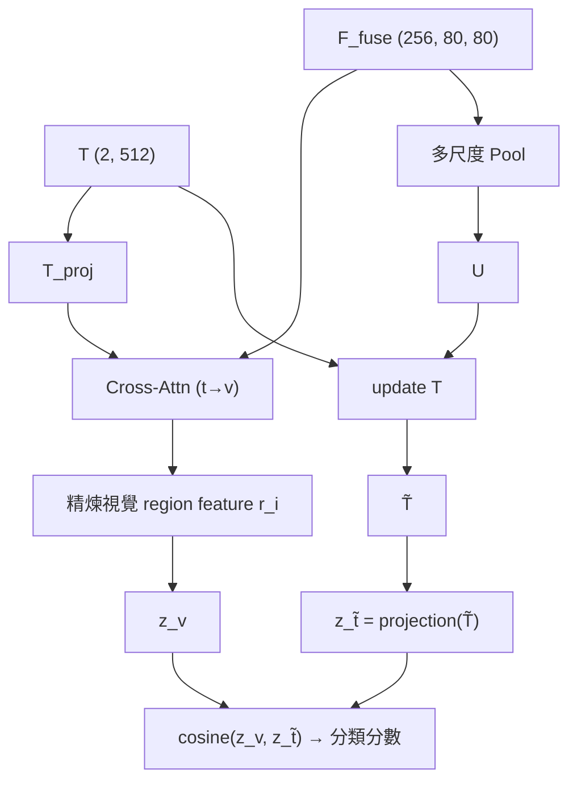

→ Detection Head 拿 $z_v$ 跟 $z_{\tilde t}$ 算 cosine,**比 CLIP 原版 T 算出來更準**。

---

# 🎓 模組 ① + ② 的「為什麼」總整理

| 設計 | 為什麼這樣? |
|---|---|
| 文字當共享 Q | 避免 RGB↔IR 直接 cross-attn 的 O(N²) 開銷 + 提供「共同語言」 |
| sigmoid 不用 softmax | 一張圖可同時有多類物件,要獨立判斷 |
| M_cons + M_dis 拆解 | 退化場景下 M_dis 救援(RGB 失效時 IR 仍能給訊號) |
| (1 + βM) 不用 βM | 沒響應的地方原 IR 特徵保留 |
| IR 引導 RGB(不是反過來) | IR 在退化場景更穩定,該當主導 |
| t→v(不用 v→t) | 類別主動撈,避免背景 pixel 投票污染 |
| 雙向 alignment(閉環) | 視覺精煉 + 文字更新都做才對得最準 |

---

# ✅ 自我檢驗(讀完試答)

1. **為什麼 $Q$ 只算一次?** 不能 RGB 跟 IR 各自算自己的 $Q$ 嗎?
2. **位置 D 上 $A_{rgb}$=0.5, $A_{ir}$=0.5**,$M_{cons}$ 跟 $M_{dis}$ 各多少?
3. **如果寫 $X_{ir} \times \beta M_{cons}$(不加 1),會發生什麼?**
4. **為什麼 Text→Vision 比 Vision→Text 好?**
5. **單向 alignment 為什麼不夠?**

如果這 5 題都答得出來,你就懂了 95%,Part 5 跟 Part 6 都會很輕鬆。

---

# 🌡️ Part 5:模組 ③ LiteDCTGhost IR Backbone(超詳細版)

## 5.0 它要解決什麼問題?

### 笨方法:直接拿 ResNet50 / CSPDarknet 跑 IR

| 模型 | 設計目標 | IR 上的表現 |
|---|---|---|
| ResNet50 | 抓 RGB 紋理 + 邊緣 + 顏色 | 24.20M 參數,FLOPs 34.18G,mAP 0.453 |
| 預期 | 應該很強 | **其實普普通通** |

**為什麼 ResNet 在 IR 上表現一般?**

```
RGB 影像的特徵:                IR 影像的特徵:
- 顏色變化大(R/G/B 三通道)    - 1 通道灰階
- 紋理豐富(衣服、皮膚紋路)    - 紋理稀少(熱輻射主導,不依賴反射)
- 邊緣銳利                     - 邊緣模糊(熱會擴散)
- 高頻細節多                   - 低頻熱分布占主導

ResNet 的卷積核被訓練去抓 RGB 的細節     ← 對 IR 幫不上忙
```

→ ResNet50 在 IR 上 = **大砲打蚊子**(模型容量浪費在它不擅長的事)。

---

## 5.1 為什麼 IR 的訊號要拆「低頻 + 高頻」?

### IR 影像的物理本質

```
IR 影像 = 熱輻射強度的灰階圖

主要訊號:
  低頻 (Low Frequency)         高頻 (High Frequency)
  ┌─────────────┐              ┌─────────────┐
  │  ███████    │              │ ─────       │
  │ █████████   │              │ │ │ │       │
  │ █████████   │              │ │ │ │       │
  │  ███████    │              │ ─────       │
  │             │              │             │
  └─────────────┘              └─────────────┘
  「人在這塊區域」              「人的輪廓在這裡」
  (整塊熱分布)                  (邊緣資訊)
  
  ↑ 主要              次要 ↑
```

兩種訊號各有用:
- **低頻**:告訴你「**有沒有人 / 在哪個大致區域**」
- **高頻**:告訴你「**人的形狀邊界精確在哪**」

### 笨方法:CNN 把兩者**混著學**
- conv kernel 同時抓低頻 + 高頻
- 但 IR 的高頻很弱,被低頻信號淹沒
- 結果:高頻訊號學不到,**邊緣偵測弱**

---

## 5.2 DCT 是什麼?用「合成樂器」理解

DCT (Discrete Cosine Transform) = **離散餘弦變換**。

### 直覺:聲音 vs 影像

**錄音的頻域**:
- 一首歌 = 不同頻率 (Hz) 的正弦波加起來
- 低音 = 鼓聲(轟轟轟,低頻能量)
- 高音 = 鈸聲(嘶嘶嘶,高頻能量)
- **DCT 對聲音**:把時域訊號分解成頻率成分

**影像的頻域**(完全平行!):
- 一張圖 = 不同空間頻率的餘弦圖案加起來
- **低頻 = 大塊變化緩慢的區域**(整片天空、人的軀幹)
- **高頻 = 局部變化劇烈**(邊緣、紋理、雜訊)
- **DCT 對影像**:把空間域訊號分解成「**空間頻率**」成分

### 視覺化 DCT 基底

```
DCT 把 8×8 影像拆成 64 個基底圖案:

低頻基底:               高頻基底:
┌─────────┐             ┌─────────┐
│         │             │ ▀▄▀▄▀▄  │
│  灰塊   │  ...        │ ▄▀▄▀▄▀  │  ...
│         │             │ ▀▄▀▄▀▄  │
└─────────┘             └─────────┘
平緩變化                 條紋密集
(低頻能量)               (高頻能量)
```

任何 8×8 影像都可以寫成「**64 個基底的加權和**」。DCT 就是算出每個基底要多重。

---

## 5.3 LiteDCTGhost 怎麼用 DCT?(具體步驟)

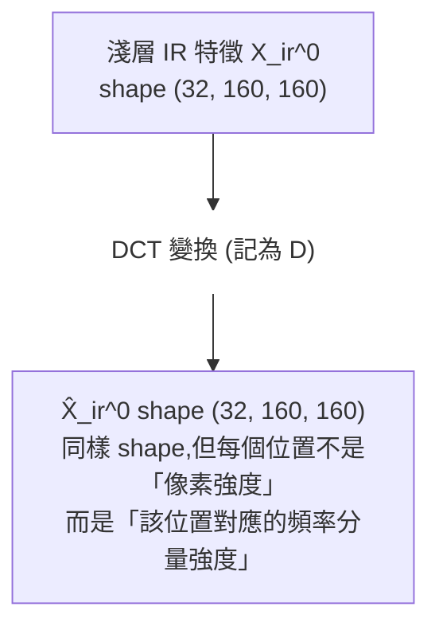

**注意**:DCT 變換後 shape 不變,只是「**值的意義**」變了。

### 可學頻率 mask

```python
M ∈ [0,1]^{H×W}     ← 一個可學的 mask,值都在 0-1 之間
```

**這個 mask 怎麼解讀?**
- M 中**靠左上角**的值高 → 模型認為「**低頻**該保留」
- M 中**靠右下角**的值高 → 模型認為「**高頻**該保留」
- M 的具體分布**完全可學**,模型自己決定

### 用 mask 切分頻譜

```
X_ir^L = D⁻¹( M ⊙ X̂_ir^0 )         ← 低頻分支(只保留 M 標的頻率)
X_ir^H = D⁻¹( (1-M) ⊙ X̂_ir^0 )     ← 高頻分支(其餘頻率)
```

⊙ = 逐元素乘法
D⁻¹ = inverse DCT(從頻域變回空間域)

**關鍵**:`M + (1-M) = 1`,所以兩個分支**完整覆蓋所有頻率**,沒丟資訊。

---

## 5.4 兩分支獨立編碼

```
X_ir^L 過小卷積 φ_L → 學「熱分布」的特徵
X_ir^H 過小卷積 φ_H → 學「邊緣輪廓」的特徵

X̃_ir^0 = φ_L(X_ir^L) + φ_H(X_ir^H)   ← 加性結合
```

### 為什麼「分開後再合」比「直接 conv」好?
- **φ_L** 完全專注於低頻 → 容量不浪費去學它根本沒看到的高頻
- **φ_H** 完全專注於高頻 → 不會被低頻能量淹沒
- 各自的 inductive bias 對齊各自的資料分布
- **1 + 1 > 2**

---

## 5.5 Ghost Module — 「便宜複製」省更多參數

普通 conv:
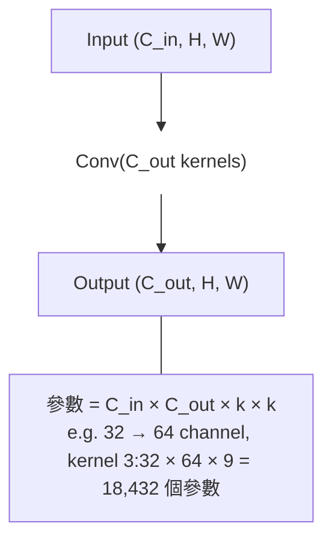

Ghost Module:
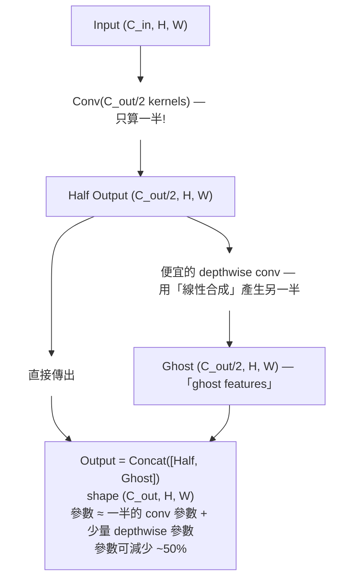

**直覺**:CNN 學出的特徵很多是**冗餘的**(很多 channel 長得像)。Ghost 用便宜的線性變換從一半 channel **合成**另一半,品質差不多但參數砍半。

---

## 5.6 SE (Squeeze-and-Excitation) — 通道重要性校準

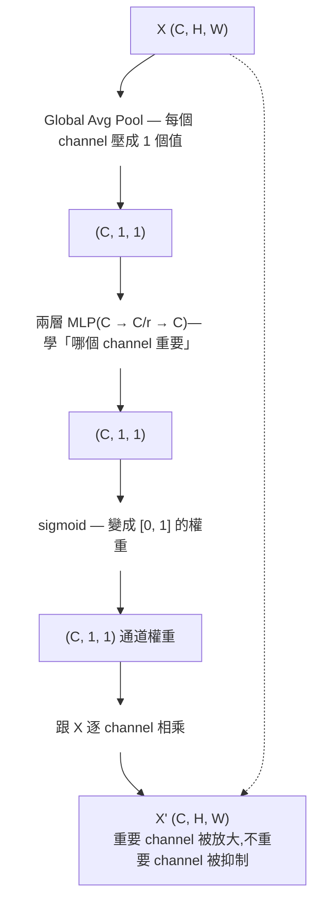

### 直覺
- 不是所有 channel 都同樣重要
- SE 學「**對這張 IR 圖,哪些 channel 該被注意**」
- 像給每個 channel 一個音量旋鈕

---

## 5.7 完整資料流(具體 shape)

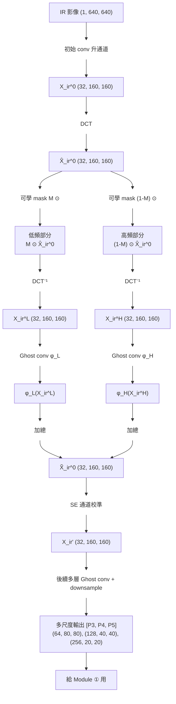

---

## 5.8 性能對比 — 為什麼這麼省

| Backbone | Params | FLOPs | mAP50 | mAP |
|---|---:|---:|---:|---:|
| ResNet50 | 24.20M | 34.18G | 0.853 | 0.453 |
| **LiteDCTGhost** | **1.05M** | **6.49G** | **0.886** | **0.504** |
| **降幅 / 提升** | **-95%** | **-81%** | **+3.3pp** | **+5.1pp** |

### 為什麼參數砍 95% 反而精度更高?

**ResNet50 對 IR 是「過參數化錯置」**:
- ResNet 24M 參數**主要在學 IR 沒有的高頻紋理**
- 那些參數對 IR 任務「沒用但會干擾」
- LiteDCTGhost 用對的 inductive bias(頻率分離),1M 參數**精準命中需要的特徵**

→ **金句**:「**對的歸納偏誤 > 大模型暴力壓**」。

---

## 5.9 整段比喻總結

**把熱感應圖當「錄音」聽**:
- **低頻** = 低音(轟轟聲、整塊熱) — 是「**有沒有人**」的訊號
- **高頻** = 高音(嘶嘶聲、邊緣銳利度) — 是「**人的形狀**」的訊號
- 普通 backbone(ResNet)把它們**混著聽** → 學不好
- LiteDCTGhost **拆成兩個分支聽** → 各自最佳化

加上:
- **Ghost** = 不用每首歌都自己錄,**複製 + 微調**省成本
- **SE** = 音響上每個喇叭的**音量旋鈕**

---

## ✅ Part 5 自我檢驗

1. **為什麼 IR 影像的主要訊號是低頻?**
2. **DCT 把影像變成什麼?shape 變了嗎?**
3. **可學 mask `M` 在哪個域操作?(空間域還是頻域?)**
4. **Ghost Module 怎麼省參數?**
5. **為什麼 1.05M 比 24.20M 強?**

---

# 🤖 Part 6:LLMDet — 訓練改革(超詳細版)

## 6.0 LLMDet 的本質

```
LLMDet ≠ 設計新架構
LLMDet = 改訓練方式

「baseline detector 不變,加上 LLM 當訓練時的家教」
```

如果你只記住一件事:**「LLM 當監督訊號,訓練後丟棄」**。

---

## 6.1 整體架構

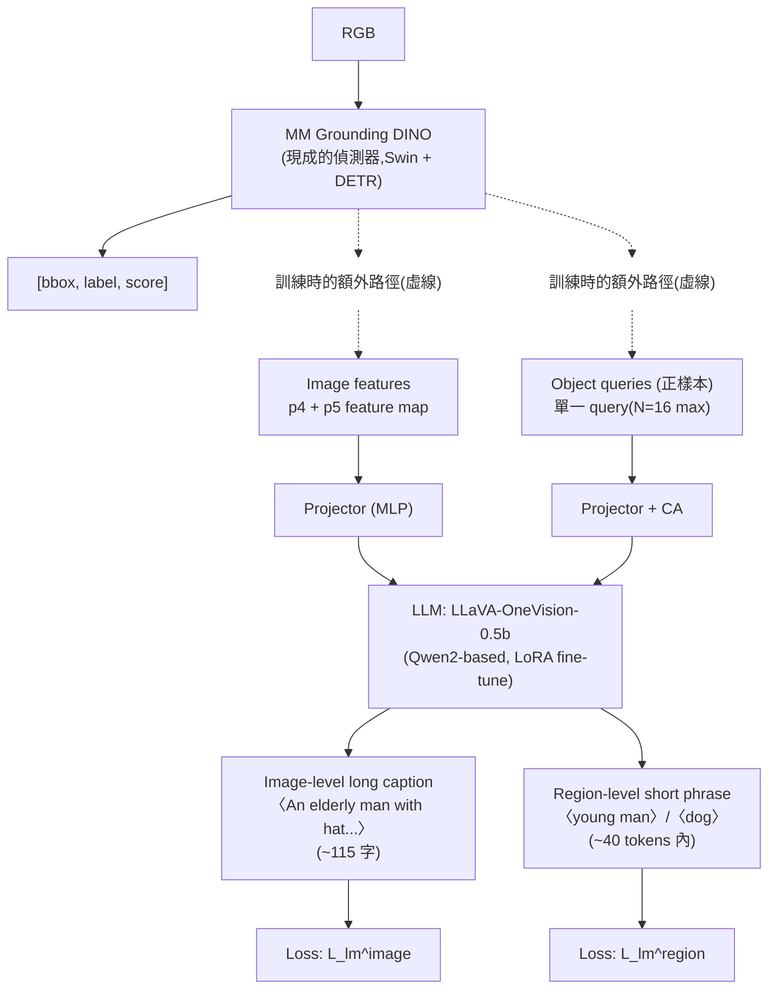

---

## 6.2 雙任務 captioning(關鍵設計)

### Task 1 — Image-level Long Caption(整圖看)

```
輸入:
  Image features:
    p4 feature map → resize 27×27 → flatten
    p5 feature map → resize 20×20 → flatten
    concat 成單一序列餵 LLM

Prompt: "Describe the image in detail."

期望輸出:
  「An elderly man with a hat walking in low light,
   partially behind a fence. A red car parked nearby...」
  (~115 字長 caption)

Loss: L_lm^image = LLM 生成 vs GT caption 的 cross-entropy
```

### Task 2 — Region-level Short Phrase(單 query 看)

```
輸入:
  從 detector decoder 拿 16 個正樣本 object query
  (每個 query 對應一個 GT box)
  Cross-Attention 模組讓 query 從 detector 撈額外資訊

Prompt: "Describe the region in a phrase."

期望輸出:
  query 1 → "young man"
  query 2 → "red car"
  query 3 → "dog"
  ...

Loss: L_lm^region = 每個 query 生成 vs GT phrase 的 cross-entropy
```

### 為什麼要「兩個 task」?(ablation 證實的關鍵)

| 只用 image-level | 只用 region-level | **兩者都用** |
|---|---|---|
| 整體語意夠 | 但 region 對應不清楚 | **互補:整體 + 局部錨定** |
| **+0.6 AP** | **+0.0 AP**(沒提升) | **+3.3 AP** ✓ |

**重點觀察**:單獨 region 沒幫助(只是類別名重複)、單獨 image 幫助有限。**兩者合用才解鎖**。

---

## 6.3 為什麼 LLM 監督比 hard label 強?

### 普通 detection 的監督
```
GT:  bbox + class_id = 17 (= "dog")

模型學到:
  「這個 bbox 內 → 應該預測 class 17」
  資訊量極低:只有 1 個 class id
```

### LLMDet 的監督(Image-level)
```
GT caption: 「a golden retriever puppy sitting on the brown leather couch,
              wearing a red collar, ears floppy, partially blocked by a cushion」

模型透過 caption loss 被迫學到:
  - 「dog」概念 (class)
  - 「puppy」(年紀)
  - 「golden retriever」(品種,細粒度)
  - 「brown leather couch」(背景脈絡)
  - 「red collar」(屬性)
  - 「partially blocked」(遮擋語意)
  
資訊量爆大!
```

→ **Caption 是「rich label」**,比 class id 多 100 倍資訊。

### 跟知識蒸餾的比較

| | 知識蒸餾 (KD) | LLMDet |
|---|---|---|
| 監督來源 | Teacher 模型的 soft label | LLM 寫的 caption |
| 形式 | 機率分布 | 自然語言 |
| 資訊量 | dark knowledge(類別間關係) | 屬性、上下文、推理 |
| 部署 | Teacher 丟掉 | LLM 丟掉(精神類似) |

→ LLMDet 可視為「**caption-supervised co-training**」,**精神類似 KD 但用 caption 而非 logit**。

---

## 6.4 兩階段訓練(為什麼分兩步)

### Step 1 — Projector Pre-Alignment(冷啟動)

```
凍結:detector ✓  LLM ✓
只訓:projector(那個小 MLP)

任務:image captioning(LSC-558k 資料)
目的:把 detector 的特徵空間 → 對齊到 LLM 輸入空間
```

**為什麼要這步?**
- detector 跟 LLM 是兩個獨立預訓練的模型
- 如果不先對齊就 end-to-end 訓,梯度會搞壞兩邊
- **先讓 projector 學會「翻譯」,再放開訓全部**

### Step 2 — End-to-End Co-Training

```
解凍:detector + projector + LLM (LoRA)
凍結:Swin backbone(沿用 grounding 預訓練)

訓練 150k 步,~2 天
```

**這時所有 loss 一起算**:
```
L = L_align + L_box + L_lm^image + L_lm^region
    └─────┘   └────┘   └────────────────────┘
   grounding   bbox       LLM caption 監督
   標準         標準        (本文創新)
```

---

## 6.5 GroundingCap-1M — 訓練資料是另一半關鍵

| 資料來源 | 樣本數 | Caption 來源 |
|---|---:|---|
| COCO | 210k | ShareGPT4V + ASv2 |
| V3Det | 166k | **Qwen2-VL-72b 自生** |
| GoldG | 437k | **Qwen2-VL-72b 自生** |
| LCS | 307k | LLaVA-OneVision |
| **總計** | **1.12M** | – |

**重點**:
- caption 不是人工標,是用 Qwen2-VL-72b(超大 VLM)自動生
- 平均每張 caption ~115 字
- 經過後處理(刪推測詞、二次重生短 caption 過濾)

**ablation 證實**:
- 用 Qwen2-VL-72b 生的 → AP_r = 38.6
- 用 LLaVA-7B 生的 → AP_r = 33.5(掉 5.1 pp)
- **caption 品質直接決定 OVD 效果**

---

## 6.6 推論時的關鍵 trick

```
推論時:
  ✓ MM Grounding DINO 跑 → bbox + label + score
  ✗ Projector 丟掉
  ✗ LLM 完全不執行
  
推論成本 = 100% 純 MM-GDINO
       = 0% 額外開銷
```

→ **這是 LLMDet 的最 sexy 設計**:「訓練時用,推論時白嫖」。

---

## 6.7 LLMDet 的「為什麼」總整理

| 設計 | 為什麼 |
|---|---|
| 用 LLM 不用 KD | caption 比 logit 資訊量大 100 倍 |
| Image-level + Region-level 兩個 task | 互補:整體語意 + 局部錨定 |
| Image task 不用 cross-attn | feature map 已夠多資訊 |
| Region task 用 cross-attn | 單一 query 資訊太少要補 |
| Projector 預訓練(Step 1) | 避免破壞 detector / LLM 的預訓練知識 |
| LLM 用 LoRA 不 full FT | LLM 太大,full FT 不可行且不必要 |
| LLM 推論時丟掉 | LLM 只在訓練時提供梯度,推論不必要 |
| 用 Qwen2-VL-72b 生 caption | 大模型生的 caption 細節豐富 → AP_r +5pp |

---

## 6.8 LLMDet 真正的 contribution

很多人誤解「LLMDet = LLM 模型」。**真實 contribution 是「方法論」**:

```
不是:設計新 detector 架構
不是:設計新 LLM

是:證明「LLM 可以當 detector 的訓練家教」
是:設計一套兩任務 captioning 範式
是:建立高品質 caption dataset 並證明品質決定效果
```

→ 你研究時可以**借這個思路**:任何模型都可以接 LLM 當 co-train 家教,推論時丟。

---

## ✅ Part 6 自我檢驗

1. **LLMDet 跟 MM-GDINO 架構差在哪?**(換成另一個 detector 行嗎?)
2. **為什麼推論時 LLM 可以丟掉,還能享受其好處?**
3. **單獨用 region-level captioning 為什麼沒幫助?**
4. **為什麼要兩階段訓練,不能一次 end-to-end?**
5. **LLM caption 比起 class id 的「資訊量優勢」是什麼?**

---

# 🎓 完整篇章複習路徑

```
看不懂 → Part 0 + Part 2(I/O + 鳥瞰圖)
半懂  → Part 3 走 5 個 Step shape + 數字例子
懂了  → Part 4 + Part 5(雙向對齊 + IR backbone)
想實作 → Part 5 完整資料流 + 看 GitHub code
LLMDet → Part 6 + 對照 LLMDet (CVPR 2025)
研究方向 → 關聯_RGB-IR Bridge × LLMDet
```

---

# 🎓 Part 7:你看完應該能回答的 6 個檢驗題

> 試著**先不看下面任何資料**回答。回答不出來 = 那塊還沒懂,回去看對應 Part。

1. **Bridging RGB-IR 的輸入有幾個?各是什麼形狀?** (Part 0)
2. **為什麼文字 query Q 兩個模態共用?不能各算各的嗎?**(Part 3 Step 1)
3. **M_cons 跟 M_dis 物理意義各是什麼?**(Part 3 Step 3)
4. **為什麼用 `(1 + βM)` 而不是 `βM`?** (Part 3 Step 4)
5. **LiteDCTGhost 為什麼參數比 ResNet50 少 95% 反而精度更高?** (Part 5)
6. **LLMDet 推論時 LLM 還在嗎?為什麼?** (Part 6)

---

# 🎯 學習路徑建議

| 程度 | 該做的事 |
|---|---|
| **看完還是糊** | 只讀 Part 0 + Part 2,先建立「I/O + 鳥瞰圖」的心智模型 |
| **大概懂但細節糊** | 讀 Part 3 走一遍 shape,然後翻回原 paper 對照 Eq.1-Eq.8 |
| **想實作** | 讀 Part 3 + Part 4 + 直接看 GitHub code |
| **想往下研究** | 讀完所有 Part + 回到 關聯_RGB-IR Bridge × LLMDet 思考 synthesis |

---

# 💬 卡住怎麼辦?

不要硬讀。最有效的順序:

1. **第一次卡** → 跳到下一段繼續讀,通常後面會解釋
2. **第二次卡** → 拿紙筆把那一段抄一遍 + 自己畫 shape 流程
3. **第三次卡** → 找 YouTube 同主題的影片(關鍵字:`open vocabulary detection`、`grounding DINO explained`)
4. **第四次卡** → 跟我說具體段落 / 公式 / 句子,我用更白話再翻一次

> 看不懂不是你笨,是這篇 paper 寫法不夠教學友善。**強的研究者也都是看 3-5 遍才懂的**。
